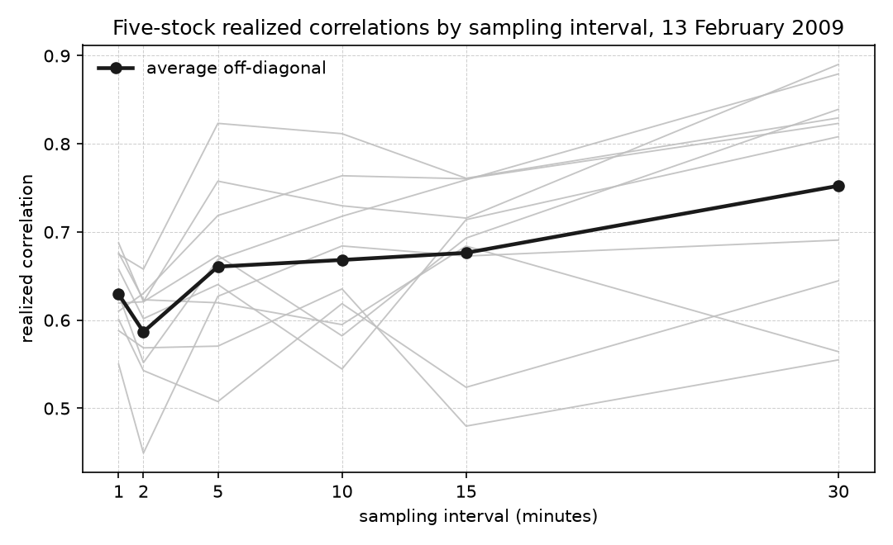
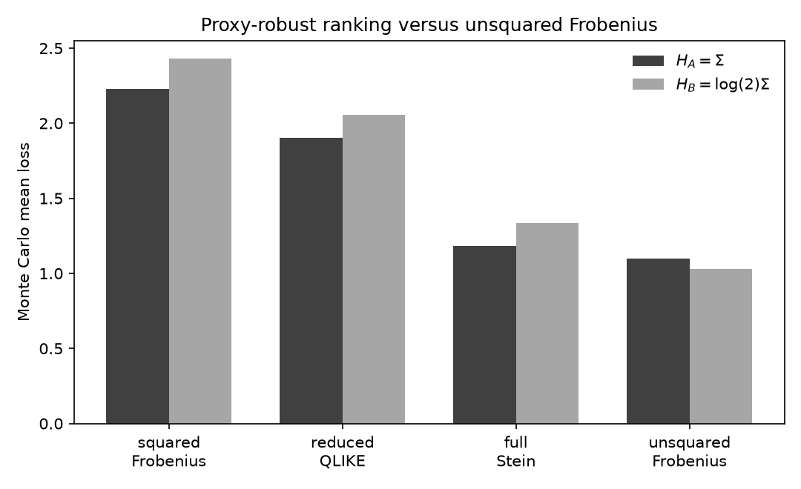
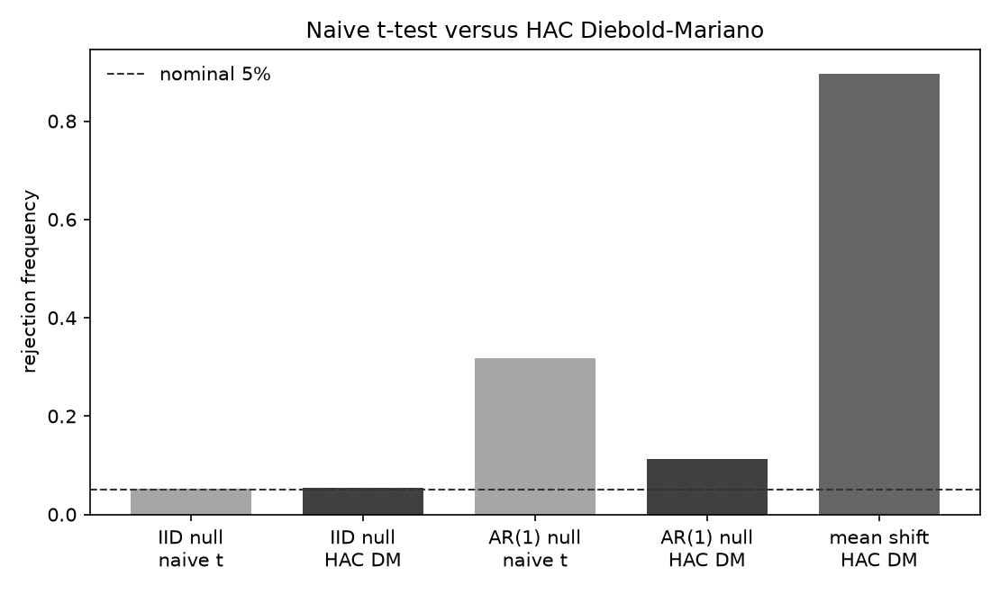

# covharness

`covharness` is a research implementation for the evaluation of one-day-ahead multivariate covariance forecasts. Its purpose is to provide a common measurement, estimation, and evaluation framework in which econometric, machine-learning, and deep-learning methods can be compared under the same empirical protocol.

The benchmark is designed so that a new forecasting method does not receive a different target, a richer information set, a larger tuning budget, or a more favorable evaluation criterion simply because it belongs to a different modeling tradition. Conventional models are therefore treated as serious competitors rather than default baselines. The planned comparison assigns common validation periods, tuning budgets, re-estimation schedules, and confirmatory procedures across model classes. Stochastic methods will be evaluated over pre-specified seed sets rather than selected ex post from favorable individual runs.

> **Current status.** The primary TAQ measurement path is exchange-level quotes, P1/P2, listing-venue P3, Q1–Q4, midquote, and previous-tick synchronization. Consolidated NBBO plus Q1–Q4 remains a labeled alternative. An Epps-effect frequency scan is implemented on the five-stock 13 February 2009 panel. Blocks 1, 2A, 2B, 3A, 3B, and 3C are closed. Covariance-space losses are implemented. Reduced QLIKE is the primary ranking loss. Squared Frobenius is the complementary robust criterion. The leak-proof temporal protocol is implemented, with CONFIRM locked by default. Pairwise Diebold-Mariano tests with Bartlett HAC standard errors are implemented. Hansen (2005) SPA and Hansen–Lunde–Nason (2011) MCS are implemented for one loss/proxy channel at a time. The generic Block 3C inference engine is implemented. Origin-day aggregate realized quarticity and the BNS equal-weight market jump indicator are implemented for the second Giacomini-White specification. Random-walk, EWMA, HAR-DRD, and HARQ-DRD realized-covariance models are implemented and synthetic/unit validated. They have not been fit on market data. Realized-kernel estimation is not implemented. The long historical extract is not solved. The DATA GATE remains closed. Protocol decisions are recorded in [`PREREGISTRATION_DRAFT.md`](PREREGISTRATION_DRAFT.md). That draft is not the final preregistration.

Detailed implementation status is maintained in [`docs/PROJECT_STATE.md`](docs/PROJECT_STATE.md).

---

## Why covariance forecast evaluation is difficult

The object of interest is the conditional covariance matrix

```math
\Sigma_{t+1\mid t} = \operatorname{Cov}(r_{t+1}\mid \mathcal{F}_t).
```

Unlike a standard supervised-learning target, this matrix is not observed directly, even after day $t+1$ has ended. Forecast evaluation must therefore rely on an ex-post covariance proxy constructed from higher-frequency observations. That proxy is informative but noisy, so a forecast comparison can be distorted by the choice of proxy, loss function, sampling scheme, or inferential procedure.

This consideration determines the structure of the repository. The measurement pipeline is fixed before forecasting models are introduced, the primary evaluation losses are chosen for their suitability with noisy volatility proxies, and confirmatory comparisons are separated from model development. The same covariance forecast is also economically relevant because portfolio variance is

```math
w^{\top}\Sigma_{t+1\mid t}w.
```

The project therefore maintains separate statistical and economic evaluation channels rather than treating one as a substitute for the other.

---

## Realized covariance proxy

Because $\Sigma_{t+1\mid t}$ is latent, forecasts are evaluated against realized covariance constructed from synchronized intraday returns. For a trading day with $M$ synchronized interval returns and $N$ assets, let

```math
R_t \in \mathbb{R}^{M\times N}.
```

The realized covariance estimator is

```math
\mathrm{RCov}_t
= R_t^{\top}R_t
= \sum_{j=1}^{M} r_{t,j}r_{t,j}^{\top}.
```

The implementation uses this unscaled Gram matrix. It does not divide by the number of intraday intervals, annualize the matrix, apply shrinkage, clip eigenvalues, or otherwise repair the estimator. Realized covariance is treated as an ex-post proxy for the latent covariance process, not as observed ground truth.

---

## Quote cleaning

Raw high-frequency quotes are not a clean observation of the latent price. Consolidated NBBO records include crossed markets, extremely wide transient spreads, and isolated midquotes that are inconsistent with neighboring quotes and with contemporaneous trades. Previous-tick synchronization cannot repair those states. It carries the most recent supplied price onto the sampling grid, so an invalid quote immediately before a grid time becomes the synchronized price.

That matters because realized covariance is a quadratic form. If $r_j$ is the synchronized return vector at interval $j$, then

```math
\mathrm{RCov}_t = \sum_{j=1}^{M} r_{t,j} r_{t,j}^{\top}.
```

An artificial return $r_{i,j}$ contributes $r_{i,j}^{2}$ on the variance diagonal and $r_{i,j} r_{k,j}$ to every covariance involving asset $i$. One contaminated interval can therefore distort an entire row and column of the daily proxy. The primary measurement pipeline is therefore

```math
\text{exchange-level quotes}
\to
\text{P1, P2}
\to
\text{P3 (listing venue)}
\to
\text{Q1–Q4}
\to
\text{midquote}
\to
\text{previous-tick synchronization}
\to
\text{log returns}
\to
\text{realized covariance}.
```

The implemented procedure is adapted from Section 5.1 of Barndorff-Nielsen, Hansen, Lunde, and Shephard (2011), who follow the more detailed trade-and-quote cleaning discussion in Barndorff-Nielsen, Hansen, Lunde, and Shephard (2009). The 2011 paper applies P3 before Q1–Q4. It retains quotes from one listing venue, NYSE for ordinary NYSE-listed names and NASDAQ for the NASDAQ-listed names in their sample.

Q1–Q4 are a single implementation, `covharness.data.quotes.clean_nbbo_quotes`. Two input adapters feed that cleaner.

**Paper-style single-exchange path.** Exchange-level quotes from `cqm_*` are restricted to the listing venue (P3) and to the requested TAQ suffix, then passed through P1, P2, and Q1–Q4. Listing venue is taken from CRSP `stocknames.exchcd` on the sample date (1 = NYSE, 3 = NASDAQ) and mapped to Daily TAQ Exchange-field codes (`N` for NYSE, `T`/`Q` for NASDAQ). Ordinary/common shares in the current five-stock extract use the blank or NULL suffix. The adapter is `covharness.data.exchange_quotes.clean_single_exchange_quotes`. It does not copy Q1–Q4.

**Consolidated NBBO alternative path.** The same Q1–Q4 function can be applied to `best_bid` / `best_ask` without P3. That path is retained and labeled. It is not deleted.

The quote rules themselves are unchanged.

P1. Delete observations outside regular exchange hours, 09:30–16:00 inclusive on the caller-supplied exchange-local clock.

P2. Delete observations with non-positive or non-finite bid or ask.

P3. On the single-exchange path only, retain quotes issued by the selected listing venue for the requested `sym_root` and `sym_suffix` identity.

Q1. If several quotes for the same security have the same timestamp, replace them by one observation using the median bid and the median ask.

Q2. Delete quotes with a negative spread, $\mathrm{ask}-\mathrm{bid}<0$. Locked quotes with zero spread are retained.

Q3. For each stock-day, compute the median spread after Q1 and Q2, and delete quotes whose spread exceeds ten times that median.

Q4. For each stock-day quote with a complete centered neighborhood, take the 25 observations immediately before and the 25 immediately after the quote, excluding the quote itself. Let $N_i$ be those 50 neighboring midquotes, $\widetilde{m}_i=\mathrm{median}(N_i)$, and $D_i$ the mean absolute deviation of $N_i$ from $\widetilde{m}_i$. Delete the quote if $|\mathrm{mid}_i-\widetilde{m}_i|>10 D_i$. If $D_i=0$, retain the center only when it equals $\widetilde{m}_i$. This $D_i$ is a mean absolute deviation from the local median, not the usual median-absolute-deviation statistic.

Q4 is a symmetric ex-post filter on historical measurement data. Neighborhoods stay inside a stock-day. After the filters, the midquote is $(\mathrm{bid}+\mathrm{ask})/2$.

Cleaning rules depend on the market-data representation to which they are applied. On 13 February 2009, the same Q1–Q4 rules applied to consolidated JPM NBBO left clustered five-minute dislocations near 22.6 at 09:45 and 10:40. Restoring the paper's P3 construction, NYSE-issued quotes for JPM, removed those five-minute artifacts. Trades around 09:45 remained near 24.93–24.99. On the single-exchange five-stock panel, no name has a five-minute return above 2 percent. JPM realized variance is 0.00138 versus 0.0477 on cleaned NBBO, and the 5×5 condition number is 39 versus about 931. The production Q1–Q4 code was not changed to obtain that result. The case study is in [`notebooks/data_cleaning_example.ipynb`](notebooks/data_cleaning_example.ipynb). The single-exchange five-stock panel is produced by `experiments/taq_five_stock_single_exchange_pilot.py`. The NBBO alternative remains in `experiments/taq_five_stock_pilot.py`.

## Synchronization and sampling

Intraday quotes do not arrive on a common clock across assets. After cleaning, covariance estimation constructs a synchronized midquote panel and only then forms returns.

**Previous-tick synchronization.** At a grid time $g$, each asset is assigned the most recent valid price observed at or before $g$. Future observations are never used for interpolation. If no prior observation is available, the synchronized value remains missing.

**Five-minute baseline.** The primary realized-covariance proxy is based on non-overlapping five-minute returns. This sampling frequency is retained as the baseline compromise between very fine sampling, where market-microstructure effects become more pronounced, and coarser sampling, where fewer intraday observations remain available for covariance estimation.

**Five-minute subsampling.** The second proxy reduces dependence on a single five-minute grid alignment. Starting from the synchronized one-minute price panel, the implementation constructs five shifted price grids with offsets $s\in\{0,1,2,3,4\}$. For each offset, every fifth price observation is selected before log returns are formed, and the existing realized-covariance function is then applied. The five covariance estimates are averaged as

```math
\mathrm{RCov}^{\mathrm{SS}}_t
= \frac{1}{5}\sum_{s=0}^{4}\mathrm{RCov}^{(s)}_t.
```

The averaging occurs across the five covariance estimates. Individual realized-covariance matrices are not divided by their numbers of intervals. The shifted estimates overlap and are not treated as independent measurements, so the construction does not imply a five-fold reduction in measurement-error variance. Missing observations are not handled through pairwise deletion, because doing so would allow different covariance entries to be estimated from different information sets.

**Epps-effect diagnostics.** Realized covariance and implied correlation are recomputed on previous-tick grids of 1, 2, 5, 10, 15, and 30 minutes from the same cleaned quotes. This is a diagnostic of the covariance proxy and synchronization procedure. It does not change the one-day-ahead forecast horizon, and no frequency is treated as the true covariance.

Statistical covariance evaluation uses the open-to-close realized-covariance proxy defined above. When global-minimum-variance evaluation is implemented later, the primary economic risk measure will include the overnight return outer product so that realized risk corresponds to a portfolio held across the overnight period. An open-to-close-only economic version will be retained as a robustness channel. Overnight realized covariance and GMV portfolios are not implemented here. The distinction is frozen before results exist.

---

## The Epps effect

A machine-learning pipeline can treat realized covariance as a label and treat a finer sampling grid as more data. That is not how the measurement object behaves.

Calendar-time realized covariance records co-movement only when two assets update inside the same sampling interval. Quotes do not arrive on a common clock. If two assets react to the same shock at slightly different observed times, a very fine grid can place those responses in different return intervals. The contemporaneous covariance contribution of that shock is then near zero. On a coarser grid, both responses can fall in the same interval, and the measured dependence can recover. Epps (1979) documented the resulting decline in measured correlation at short intervals. Barndorff-Nielsen, Hansen, Lunde, and Shephard (2011) treat nonsynchronous trading, together with microstructure noise, as a reason that simple calendar-time realized covariance is a noisy and potentially attenuated proxy, and they develop multivariate realized kernels as a later estimator. We keep unscaled calendar-time $\mathrm{RCov}$ as the baseline proxy and use the frequency scan as a diagnostic rather than as a search for a true matrix.

A one-shock sketch is enough for the evaluation implication. Asset A updates at 10:00:10 and asset B at 10:00:40. On a one-second grid those moves occupy different return bins, so their product does not enter that second's outer product. On a five-minute grid ending at 10:05 both moves occupy the same bin. Finer sampling therefore yields more return observations without automatically yielding a better covariance label. A forecasting model can appear to predict low correlations well because the realized-covariance proxy itself is attenuated.

The implemented diagnostic is `covharness.diagnostics.epps`. It reuses the production previous-tick synchronizer and the unscaled Gram-matrix realized covariance. For each frequency it reports the number of synchronized returns, the covariance and correlation matrices, off-diagonal correlation summaries, the individual pairwise correlations, eigenvalues, numerical rank, minimum eigenvalue, PSD status, and a condition number when the smallest eigenvalue is strictly positive. The average off-diagonal series is not forced to be monotonic.

On 13 February 2009, the five-stock single-exchange panel is a one-day demonstration, not an estimate of the magnitude of the Epps effect in U.S. equities. The later paper will rerun the diagnostic on the larger panel and report cross-day distributions. The figure below shows sampling interval against realized correlation. The heavy line is the average off-diagonal correlation. The light lines are the ten unique pairs.



The anomalous fine-frequency JPM results reported before the identity repair were not a Q1–Q4 failure on common stock. Root-only TAQ extraction mixed the blank/NULL-suffix JPM common share with preferred-share series that share `sym_root='JPM'` and NYSE `ex='N'`. Those preferred-share observations were valid quotes for different securities. They were not bad common-stock quotes. TAQ `sym_suffix` is therefore required when identifying the security. On this millisecond CQM table the ordinary share is stored as SQL NULL. After the extract was restricted to that identity, no nonblank JPM suffix remains in the common-stock stream.

The figure is the corrected one-day, five-name diagnostic. Average off-diagonal correlation is 0.629 at one minute, 0.587 at two minutes, 0.661 at five minutes, and 0.752 at thirty minutes. That pattern is not treated as a general estimate of the Epps effect in U.S. equities. Q1–Q4, previous-tick, sampling frequencies, and the universe were not changed. Derived tables are in [`results/taq_five_stock_epps_20090213.json`](results/taq_five_stock_epps_20090213.json), [`results/taq_jpm_one_minute_forensics_20090213.json`](results/taq_jpm_one_minute_forensics_20090213.json), and [`results/taq_jpm_provenance_closeout_20090213.json`](results/taq_jpm_provenance_closeout_20090213.json).

---

## Data access and provenance

The empirical implementation uses institutional market data obtained through WRDS. The 13 February 2009 five-stock sample (IBM, AAPL, MSFT, JPM, XOM) is a validation extract, not a multi-year dataset. The paper-style path uses `taqmsamp_all.cqm_20090213`. The labeled NBBO alternative uses `taqmsamp_all.nbbom_20090213`.

The intended architecture separates data acquisition from statistical estimation. WRDS retrieval lives under `experiments/`. Quote cleaning, P3 venue selection, synchronization, return construction, and realized-covariance estimation remain library stages. Persistent security identifiers will be preferred to ticker symbols where the available CRSP and TAQ linking resources permit this.

On 13 February 2009 the paper-style path uses CRSP listing venues mapped to TAQ `ex` codes. IBM, JPM, and XOM are NYSE (`N`). AAPL and MSFT are NASDAQ (`T`/`Q`). The production quote extract matches `sym_root`, listing-venue `ex`, and the ordinary-share `sym_suffix`. On this CQM table that suffix is SQL NULL. Blank strings are also accepted. `sym_suffix` is selected so identity remains auditable. The NBBO alternative extract remains `taqmsamp_all.nbbom_20090213`. Raw licensed market data are not committed. Derived diagnostics are in `results/taq_five_stock_single_exchange_20090213.json`, `results/taq_five_stock_pilot_20090213.json`, `results/taq_five_stock_epps_20090213.json`, `results/taq_five_stock_epps_20090213.png`, `results/taq_jpm_one_minute_forensics_20090213.json`, and `results/taq_jpm_provenance_closeout_20090213.json`.

---

## Statistical evaluation losses

The covariance target is latent. After the day has ended we still do not observe $\Sigma_{t+1\mid t}$. Evaluation uses a realized-covariance proxy $S$ in place of that matrix. With a conditionally unbiased proxy, $\mathrm{E}[S\mid\mathcal{F}]=\Sigma$, ranking forecasts by a robust loss agrees with ranking them against the latent target (Patton, 2011; Laurent, Rombouts, and Violante, 2013). The losses below are fixed before confirmatory evaluation.

**Squared Frobenius.** The adopted Frobenius ranking loss is the squared distance

```math
L_F(S,H)
=\|S-H\|_F^2
=\operatorname{tr}\bigl((S-H)^{\top}(S-H)\bigr)
=\sum_{ij}(S_{ij}-H_{ij})^2.
```

This is the matrix analogue of mean squared error. If $\mathrm{E}[S\mid\mathcal{F}]=\Sigma$, then

```math
\mathrm{E}\bigl[\|S-H\|_F^2\bigr]
=\|\Sigma-H\|_F^2
+\mathrm{E}\bigl[\|S-\Sigma\|_F^2\bigr].
```

The second term does not depend on the forecast. Taking the square root destroys that decomposition, so the ordinary Frobenius norm is not used for ranking. There is no scaling or annualization inside the loss. PSD is not required merely to compute it.

**Reduced multivariate QLIKE.** The primary ranking loss is

```math
L_Q(S,H)
=\log\det(H)+\operatorname{tr}(H^{-1}S).
```

$S$ must be square, finite, symmetric, and PSD. It may be singular. $H$ must be strictly PD. The implementation factorizes $H=LL^{\top}$ by Cholesky and uses that same factor for $\log\det(H)=2\sum_i\log L_{ii}$ and for the solves that compute $\operatorname{tr}(H^{-1}S)$. It does not form $H^{-1}$. A failed Cholesky is the positive-definiteness failure. The loss does not add jitter, clip eigenvalues, or otherwise repair a forecast.

**Full Stein.** When both $S$ and $H$ are SPD,

```math
L_S(S,H)
=\operatorname{tr}(H^{-1}S)-\log\det(H^{-1}S)-N
=L_Q(S,H)-\log\det(S)-N.
```

Reduced QLIKE and full Stein are not numerically equal. For a common SPD target they differ only by a target-only term, so model rankings and pairwise loss differentials agree. Full Stein rejects a singular $S$ because $\log\det(S)$ is undefined. A rank-deficient realized-covariance proxy does not by itself prevent evaluation with squared Frobenius or reduced QLIKE. Rank deficiency can still increase proxy noise and reduce inferential power.

**Variance-versus-correlation localization.** A separate diagnostic reports $\sum_i(S_{ii}-H_{ii})^2$ and $\|R(S)-R(H)\|_F^2$, where $R(A)=D(A)^{-1}AD(A)^{-1}$ and $D(A)=\mathrm{diag}(\sqrt{A_{ii}})$. These are descriptive. Correlation normalization is nonlinear, so an unbiased covariance proxy does not imply an unbiased correlation proxy. The diagnostics do not inherit the ranking-consistency guarantee of covariance-space Frobenius and QLIKE. A nonpositive diagonal is rejected rather than repaired.

The proxy-robustness construction $S=u\Sigma$ with $u\sim\mathrm{Exp}(1)$ is in `covharness.losses.robustness` and [`notebooks/proxy_robust_losses.ipynb`](notebooks/proxy_robust_losses.ipynb). $H_A=\Sigma$ ranks above the median-matched $H_B=\log(2)\Sigma$ in expected squared Frobenius, reduced QLIKE, and full Stein. Ordinary unsquared Frobenius ranks $H_B$ first. Single-draw $H_B$ win rates need not match those expected-loss rankings. The figure is [`results/proxy_robust_losses.png`](results/proxy_robust_losses.png).



---

## Temporal protocol

Forecast comparison uses four chronological regions on a strictly increasing trading-date index. HISTORY (rolling burn-in), VALIDATION, SCREEN, and CONFIRM. The ordering is HISTORY < VALIDATION < SCREEN < CONFIRM. There is no shuffling, and the three evaluation blocks do not share target dates.

Intervals are half-open, $[start, end)$, on that index. Evaluation blocks are sets of forecast targets. At origin $t$ the model may use information through $t$. The target is the next trading day $t+1$, which does not enter fitting, scaling, features, or graph construction. The common method is a rolling window of $m=250$ trading days with a 21-trading-day refit cadence.

VALIDATION has a target length of 250 trading days. SCREEN and CONFIRM have committed minima of 500 days. If a calendar cannot support the preferred 250/500/500 evaluation allocation, VALIDATION is shortened first and that fact is reported. A zero-length VALIDATION block makes data-driven tuning unavailable. SCREEN and CONFIRM are not silently reduced. An infeasible confirmatory design fails rather than fitting the sample.

VALIDATION is the only block used for tuning and configuration choice. SCREEN compares frozen candidates. CONFIRM is the locked confirmatory comparison. Retrieving CONFIRM dates raises `ConfirmLockedError` unless `unlock_confirm=True` is passed. The default is locked.

Scalers are fit on the estimation window through $t$ only. Stochastic methods use the pre-specified seeds $(0,1,2,3,4)$ and report the full seed distribution. Each model family has an auditable configuration cap of 20. The protocol records these constraints. It does not yet run forecasting models or a tuning engine.

---

## Pairwise predictive inference

A lower average loss is not enough to establish superiority. Loss differentials can be serially dependent, so a long streak of wins is not independent evidence. The implemented pairwise test is Diebold-Mariano with Bartlett / Newey-West HAC standard errors. It asks whether the mean loss differential is zero. It is a forecast-comparison statement, not a proof that one population model is the true model.

For forecasts A and B the loss differential is

```math
d_t = L_{A,t} - L_{B,t}.
```

Then $d_t<0$ means A has lower loss on date $t$, and $d_t>0$ means B has lower loss. The null is $\mathrm{E}[d_t]=0$. The statistic is

```math
\mathrm{DM}=\frac{\bar d}{\widehat{\mathrm{se}}_{\mathrm{HAC}}(\bar d)}.
```

The HAC estimator uses the Bartlett kernel and the Newey-West (1994) lag $L=\lfloor 4(T/100)^{2/9}\rfloor$, with an optional explicit lag. $L=0$ is the heteroskedasticity-only case. If every supplied differential observation is exactly equal, HAC and Diebold-Mariano are undefined and `DegenerateLossDifferentialError` is raised before demeaning. Constancy is not inferred from a variance floor. A genuinely nonconstant series with small variance remains valid. A non-finite HAC long-run variance is rejected rather than stored. No jitter is added. p-values use the asymptotic $N(0,1)$ reference. The Harvey-Leybourne-Newbold small-sample correction is not applied because the design has not committed to it.

Nested comparisons require separate care. Clark-West is implemented only for scalar squared-error forecasts, and only when the caller declares `nested=True`. It is not applied to reduced QLIKE or squared Frobenius. A later nested covariance comparison may need a loss-specific justified procedure.

Diagnostics for a headline pair are the cumulative sum $C_t=\sum_{s\le t}d_s$, the sample ACF of $d_t$, the HAC inflation $\kappa=\hat\omega/\hat\gamma_0$, and $T_{\mathrm{eff}}=T/\kappa$ when those ratios are defined. $T_{\mathrm{eff}}$ is not clipped into $[1,T]$.

---

## Multiple-model screening

Pairwise Diebold-Mariano does not control search over a universe. SPA and the Model Confidence Set are implemented on a finite loss matrix $L_{t,m}$ of shape $(T,M)$. Each column is one frozen forecasting method. Each row is one evaluation date of a single loss/proxy channel. Lower loss is better. Inputs are copied and must be finite. SPA and MCS are run separately for every pre-specified channel. Reduced QLIKE and squared Frobenius are never averaged. Distinct covariance proxies are never pooled into one matrix.

Resampling is the joint Politis–Romano stationary bootstrap. Time indices are shared across model columns. The expected block length is $\ell=\max(2,\lfloor T^{1/3}\rfloor)$ with restart probability $q=1/\ell$. This rule is a function of $T$ only. It does not inspect loss autocorrelations or model rankings. The cube-root choice is the bandwidth that satisfies Hansen's conditions $q_T\to 0$ and $T q_T^2\to\infty$. A $\sqrt{T}$ length would violate the second condition. Production defaults are $B=5000$ resamples and seed $20260913$. MCS draws one index matrix and reuses it at every elimination step.

Hansen SPA tests whether any alternative beats a supplied benchmark. The project benchmark will later be HAR-DRD. The SPA differential is $d_{k,t}=L_{0,t}-L_{k,t}$, so a positive value means alternative $k$ has lower loss than the benchmark. The null is $\mathrm{E}[d_k]\le 0$ for every $k$. The studentized statistic is

```math
T_n^{\mathrm{SPA}}
=\max\Bigl(0,\ \max_k n^{1/2}\bar d_k/\hat\omega_k\Bigr).
```

$\hat\omega_k^2$ is Hansen's stationary-bootstrap population long-run variance with geometric kernel $\kappa(n,i)$. It is not the Block 3A Bartlett / Newey-West HAC estimator. The same $\hat\omega_k$ is used for the observed statistic and every bootstrap replicate. Three recenterings are computed from Hansen's $g_l$, $g_c$, and $g_u$, including the consistent LIL threshold $-\sqrt{2\log\log n}$. Bootstrap p-values use the strict rule $\mathrm{mean}(T^\ast>T)$. The primary p-value is the consistent recentering. Lower, consistent, and upper p-values are all returned and satisfy $\hat p^l\le\hat p^c\le\hat p^u$. The headline SPA level is $0.05$. An exact-constant benchmark-versus-alternative differential raises `DegenerateLossDifferentialError`. No jitter is added.

The Model Confidence Set asks which models cannot be distinguished from the best. Pairwise differentials are $d_{ij,t}=L_{i,t}-L_{j,t}$, so a positive value means $i$ is worse than $j$. Both coherent Hansen–Lunde–Nason pairs are implemented. The primary SCREEN procedure is $(T_R,e_R)$ with $T_R=\max|t_{ij}|$ and $e_R=\arg\max_i\sup_j t_{ij}$. The companion is $(T_{\max},e_{\max})$. The two pairs are never crossed. Studentization uses standard errors. MCS bootstrap p-values use $\mathrm{mean}(T^\ast\ge T)$. Model p-values are the running maximum along the elimination path, so membership at any $\alpha$ is $\hat p_i\ge\alpha$ without rerunning the bootstrap. The last surviving model has p-value 1. The frozen SCREEN membership level is $\alpha=0.10$. Ties in elimination are broken by original column index. Identical loss columns are treated as ties with $t_{ij}=0$. A pairwise differential that is constant and nonzero raises `DegenerateMCSDifferentialError`.

Simulation is required to validate estimators, losses, and inference against known truth before relying on market data. Simulation never substitutes for the project's final empirical finding. A fixed-seed demonstration of naive $t$-test over-rejection versus HAC DM is in [`notebooks/dm_hac_size.ipynb`](notebooks/dm_hac_size.ipynb) and [`results/dm_hac_size.png`](results/dm_hac_size.png).



---

## Conditional predictive ability

Unconditional Diebold-Mariano tests whether mean loss differs. Giacomini-White tests whether the loss differential is unpredictable given origin-measurable instruments. For methods A and B the project differential remains $d_t=L_{A,t}-L_{B,t}$. Instruments $h_t$ are known at the forecast origin. The one-step moments are $Z_t=h_t d_t$, with $\bar Z=T^{-1}\sum_t Z_t$ and

```math
\widehat{\Omega}
= T^{-1}\sum_{t=1}^{T} Z_t Z_t^{\top}.
```

$Z_t$ is not demeaned. The default one-step covariance is this outer product. Bartlett / Newey-West HAC is not used in the default GW statistic. The Wald statistic is $GW=T\bar Z^{\top}\widehat{\Omega}^{-1}\bar Z$, referred to $\chi^2_q$ with $q$ equal to the number of instruments. The frozen level is $\alpha=0.05$.

A nonzero constant differential is a valid GW test when the instruments have full column rank. That case is not copied from the Block 3A constant-differential degeneracy rule, which is a Diebold-Mariano rule. All-zero moments, a singular or non-finite $\widehat{\Omega}$, and duplicate or rank-deficient instrument directions raise explicit errors. No ridge, jitter, pseudo-inverse, or silent column dropping is applied.

The frozen market-state specification uses origin-day realized covariance $S_t$ only.

```math
h_{\mathrm{market},t}
=
\bigl[
1,\
\log(\operatorname{mean}_i S_{ii,t}),\
\operatorname{mean}_{i<j} R_{ij}(S_t)
\bigr].
```

These instruments are not standardized. Target-day matrices and full-CONFIRM quantiles are forbidden.

The frozen measurement/stress specification uses origin-day synchronized intraday returns only. Per-asset realized quarticity is $\mathrm{RQ}_i=(M/3)\sum_j r_{j,i}^4$. The aggregate is the cross-sectional mean $\mathrm{RQ}_{\mathrm{agg}}=\mathrm{mean}_i\mathrm{RQ}_i$. The jump state is the one-sided 1 percent Barndorff-Nielsen and Shephard (2006) adjusted-ratio test applied to the equal-weight intraday market return $\bar r_j=\mathrm{mean}_i r_{j,i}$. Large negative standardized values indicate jumps. The indicator is $1\{Z_{\mathrm{jump}}<\Phi^{-1}(0.01)\}$. This is a common-market jump state. It is not an any-constituent-jumped indicator. The measurement/stress vector is

```math
h_{\mathrm{measurement},t}
=
\bigl[
1,\
\log(\mathrm{RQ}_{\mathrm{agg},t}),\
\mathbf{1}\{\text{BNS market jump at origin } t\}
\bigr].
```

These instruments are not standardized. The family helper runs the two already-constructed specifications separately. It reports raw p-values, Bonferroni-adjusted p-values $\min(1,2p)$, family size 2, family $\alpha=0.05$, and per-test cutoff $0.025$. The six instrument columns are never stacked into one omnibus test.

## Covariance-forecast calibration

The primary Mincer-Zarnowitz representation is the Patton–Sheppard common-coefficient pooled-vech regression. For every date $t$ and unique pair $i\le j$,

```math
S_{ij,t}
=
\alpha
+
\beta H_{ij,t}
+
e_{ij,t},
```

with one common intercept and one common slope. The null is $(\alpha,\beta)=(0,1)$. The 100-random-portfolio MZ design is not used. Stacked $T\cdot N(N+1)/2$ rows are not treated as independent. Coefficients are computed from all unique entries. Daily scores sum pair-level contributions within each date. The sandwich covariance uses Bartlett / Newey-West HAC on that daily score sequence, with the Block 3A lag and kernel convention. The headline level is $0.05$. Exact calibration with a vanishing residual returns Wald $0$, p-value $1$, and `covariance=None`. An exact linear violation of the restriction returns Wald $\infty$, p-value $0$, and `covariance=None`. Ordinary cases return a numeric sandwich. No jitter is added. Diagonal-only and off-diagonal-only pooled coefficients are returned as descriptive diagnostics. They do not carry a headline familywise claim.

State-augmented MZ uses the same pooled representation with origin-day

```math
z_t
=
\bigl[
\log(\operatorname{mean}_i S_{ii,t}),\
\operatorname{mean}_{i<j} R_{ij}(S_t)
\bigr]
```

and common project-specific coefficients $\gamma_1$ and $\gamma_2$. That pooled state restriction is not Patton–Sheppard's elementwise augmented MZ. The null is $\alpha=0$, $\beta=1$, $\gamma_1=0$, $\gamma_2=0$. GW asks whether state predicts relative loss. Augmented MZ asks whether state predicts one model's calibration error.

Approximate Patton–Sheppard equation-21 weighting uses the scale $s_{ij,t}=\sqrt{H_{ii,t}H_{jj,t}}$, not the product $H_{ii,t}H_{jj,t}$. Every regression column, including any state regressors, is divided by the same scale. The transformed forecast entry is the forecast correlation. On the diagonal this reduces to division by $H_{ii,t}$. The label is `approximate_ps21`. It is never `exact_gls`, because realized covariance is a proxy and the true conditional proxy-error variance is not known. Forecast diagonals must be finite and strictly positive. No epsilon floor is applied. Weighting does not remove serial dependence. Inference still uses the daily-score HAC sandwich. Approximate PS21 is a robustness re-estimation of standard calibration. OLS versus WLS is not selected by whichever rejects.

Headline standard MZ on the two finalists is a Bonferroni family of size 2. Augmented MZ on the same two finalists is a separate family of size 2. Both report raw and Bonferroni-adjusted p-values.

## Time-local forecast comparison

The Giacomini–Rossi fluctuation test is Proposition 1 in the GW-method version. The differential remains $d_t=L_{A,t}-L_{B,t}$. A negative local statistic means A is locally better. A positive local statistic means B is locally better. The frozen window fraction is $\mu=0.30$. The integer centered-window length is $m=2\lfloor 0.30 P/2\rfloor$, which is always even. The test requires $P>m$ and $m\ge 2$. The local path is

```math
F_t
=
\hat\omega^{-1}
m^{-1/2}
\sum_{j=t-m/2}^{t+m/2-1} d_j.
```

The asymptotic process divides by $\sqrt{\mu}$, not by $\mu$. Only the two-sided test is formal. At $\mu=0.30$ and $\alpha=0.05$ the Giacomini–Rossi Table I critical value is $k=3.012$. The test rejects when $\max_t |F_t|>3.012$. No formal one-sided companion is implemented. The sign of the two-sided path is reported descriptively. Centers are the interior positions after dropping the first and last $m/2$ dates. The One-Time Reversal test is not implemented.

The global long-run variance is estimated once from the full confirmatory differential. Uncentered autocovariances are $\gamma_j^0=P^{-1}\sum_{t=j+1}^{P}d_t d_{t-j}$. The Block 3A Newey–West 1994 lag and Bartlett weights are reused. The demeaned Block 3A HAC estimator is not called. $\hat\omega$ is not re-estimated inside local windows. Zero, negative, or non-finite $\hat\omega^2$ is rejected. No jitter or clipping is applied.

Development and confirmation are separated chronologically by the implemented protocol. Model specifications, hyperparameters, information sets, and evaluation criteria are frozen before the locked confirmatory block is examined.

---

## Planned economic evaluation

A statistically more accurate covariance forecast need not produce a lower-risk portfolio. The benchmark therefore includes a separate global-minimum-variance evaluation. For a covariance forecast $\widehat{\Sigma}_t$, the unconstrained GMV weights are

```math
w_t
= \frac{\widehat{\Sigma}_t^{-1}\mathbf{1}}
{\mathbf{1}^{\top}\widehat{\Sigma}_t^{-1}\mathbf{1}}.
```

The planned analysis will compare realized portfolio variance and, in later stages, turnover and transaction costs. Primary economic risk will include the overnight outer product. Open-to-close-only GMV remains a robustness channel. This channel is deliberately separate from covariance-space forecast loss because portfolio construction depends on the precision matrix $\widehat{\Sigma}_t^{-1}$. A method can improve a covariance estimate under one matrix loss while degrading the stability or economic usefulness of its inverse.

---

## Benchmark model universe

The initial benchmark is designed to span naive, realized-measure, shrinkage, dynamic-correlation, and shallow machine-learning approaches. The planned first-stage model set is

- random-walk realized covariance
- EWMA
- HAR-DRD
- HARQ-DRD
- Ledoit-Wolf linear shrinkage
- Ledoit-Wolf nonlinear shrinkage
- DCC
- DCC-NL
- Ridge-DRD

Later extensions include LSTM-BEKK, LSTM-BEKK-RC, and XGBoost-DRD. GHAR is a Block-4 structured graph / econometric covariance baseline. It is not classified as a deep-learning model. One graph-neural architecture remains unresolved and must be frozen before final preregistration. iTransformer is optional and is not committed.

The comparison is intended to equalize opportunity rather than model complexity. Conventional models will receive the same validation period, configuration budget, and re-estimation cadence as newer methods. If a model is evaluated with a different information set, that distinction will be made explicit and analyzed rather than hidden within the implementation.

### Realized-covariance baselines

The common model contract is `covharness.models.CovarianceModel`. Realized-covariance models that consume only a covariance cube inherit `RealizedCovarianceModel`. HARQ-DRD uses the same forecast object and a `fit` that also takes a $(T,N)$ per-asset quarticity window. The protocol constructs those windows. Models do not inspect VALIDATION, SCREEN, or CONFIRM labels. The one-step forecast is an independent $N\times N$ copy. Inputs are not mutated. There is no silent matrix repair.

Random-walk realized covariance is the origin observation itself.

```math
H_{t+1\mid t}=S_t.
```

Earlier matrices in the window do not enter. A singular PSD $S_t$ remains singular. Reduced QLIKE still requires a strictly PD forecast at evaluation time. That limitation is diagnosed, not repaired in the model.

EWMA is defined on the realized-covariance sequence $S_0,\ldots,S_{T-1}$ with decay $\lambda\in(0,1)$.

```math
H_0=S_0,\qquad
H_j=\lambda H_{j-1}+(1-\lambda)S_j,\quad j=1,\ldots,T-1.
```

The forecast is $H_{T\mid T-1}=H_{T-1}$. This is not an EWMA of daily-return outer products. $\lambda$ is an explicit constructor argument. The conventional RiskMetrics reference $0.94$ may be passed by a caller. It is not a tuned project choice. The planned 20-point VALIDATION grid is not frozen and has not been run.

Headline HAR-DRD is a Zhang-style non-overlapping HAR on the Oh–Patton DRD split of each supplied realized covariance. The model is in levels. There is no log-variance transform, Fisher transform, ridge, graph term, or HARQ term.

For every supplied $S_t\in\mathbb{R}^{N\times N}$ we set $v_t=\operatorname{diag}(S_t)$, $D_t=\operatorname{diag}(\sqrt{v_t})$, and $R_t=D_t^{-1}S_t D_t^{-1}$. Every diagonal entry of every $S_t$ must be strictly positive. Positive semidefiniteness alone is not sufficient if a diagonal is zero, because $R_t$ is then undefined. Such a window is rejected with `InvalidModelInputError`. Input matrices are not altered.

Unique correlations use the repository's existing strict upper-triangle order $i<j$, matching `np.triu_indices(N, k=1)` in the Epps and Giacomini–White helpers. The pair count is $P=N(N-1)/2$.

At response date $k\ge 22$ the non-overlapping HAR features are one daily lag, four weekly observations, and seventeen monthly observations.

```math
z_d(k)=\text{value}[k-1],\qquad
z_w(k)=\operatorname{mean}(\text{value}[k-5:k-1]),\qquad
z_m(k)=\operatorname{mean}(\text{value}[k-22:k-5]).
```

The Python slices are exclusive on the right. The three blocks do not overlap. For a supplied window of length $T=250$ the response dates are $22,\ldots,249$, so there are $228$ regression dates, $228N$ variance observations, and $228P$ correlation observations. The construction never reads before local index $0$. Predictors for the target immediately after the window are $\text{value}[T-1]$, $\operatorname{mean}(\text{value}[T-5:T-1])$, and $\operatorname{mean}(\text{value}[T-22:T-5])$.

Variance equations have asset-specific intercepts $\alpha_D\in\mathbb{R}^N$ and three shared scalar slopes $\beta_D=(\beta_{D,d},\beta_{D,w},\beta_{D,m})$. Correlation equations have pair-specific intercepts $\alpha_R\in\mathbb{R}^P$ and three shared scalar slopes $\beta_R$. We estimate those maps by the exact fixed-effects within transformation. For each group we demean $y$ and the three-column design, stack only the demeaned three-column matrices, solve $\beta$ by least squares, and recover intercepts from the group means. We do not build an $N$-column or $P$-column intercept-dummy matrix.

The raw one-day forecast reconstructs $R_{\mathrm{raw}}$ with unit diagonal in the frozen pair order. When $v_{\mathrm{raw}}$ is finite and strictly positive, $H_{\mathrm{raw}}=D_{\mathrm{raw}}R_{\mathrm{raw}}D_{\mathrm{raw}}$ with $D_{\mathrm{raw}}=\operatorname{diag}(\sqrt{v_{\mathrm{raw}}})$. Raw components are stored even if the headline matrix is later replaced.

The headline forecast uses an explicit BPQ-style insanity filter. The raw forecast is valid only when every $v_{\mathrm{raw}}$ is finite and strictly positive, every $x_{\mathrm{raw}}$ is finite, every pairwise correlation lies in $[-1,1]$, $R_{\mathrm{raw}}$ is symmetric and strictly positive definite, and $H_{\mathrm{raw}}$ is finite, symmetric, and strictly positive definite. If all of those hold, $H_{\mathrm{final}}=H_{\mathrm{raw}}$, `repaired=False`, and `repair_method=None`. If any condition fails, $H_{\mathrm{final}}$ is the arithmetic mean of every realized covariance in the current supplied estimation window, `repaired=True`, and `repair_method="estimation_window_mean"`. That fallback itself must be finite, symmetric, and strictly positive definite. Otherwise the model raises `InvalidModelForecastError`. There is no second repair. We do not clip correlations, floor eigenvalues, call `cov_nearest`, apply Higham projection, add jitter, diagonal-load, transform $v$ or $x$, or replace individual entries. Repair is never silent. Repair frequency will be reported. A valid final matrix does not imply that the raw forecast was valid.

HAR-DRD, HARQ-DRD, random walk, and EWMA have been validated on synthetic matrices only. No empirical horse race has begun because the DATA GATE remains unresolved.

Headline HARQ-DRD is HAR-DRD plus one daily per-asset quarticity interaction on the variance equation. The correlation map is unchanged. There is no weekly or monthly quarticity term, no correlation attenuation, no log-variance transform, no Fisher transform, no ridge, and no graph term.

The documented per-asset realized quarticity is $\mathrm{RQ}_{i,t}=(M/3)\sum_l r_{i,t,l}^4$. HARQ consumes a precomputed window of shape $(T,N)$ aligned with the covariance history. It does not read raw intraday returns. That per-asset series is not the cross-sectional aggregate $\mathrm{RQ}_{\mathrm{agg}}=\mathrm{mean}_i\mathrm{RQ}_i$ used by the second Giacomini-White measurement state, and it is not logged. Zero RQ is allowed. Negative or non-finite RQ is rejected. Empirical construction of the $(T,N)$ panel from TAQ waits for the DATA GATE.

Variance intercepts $\alpha_Q$ are asset-specific. The four shared variance slopes are daily, the quarticity interaction $\phi_{Q,d}$ on $\sqrt{\mathrm{RQ}_{i,k-1}}\,v_{i,k-1}$, weekly, and monthly. No sign constraint is imposed on $\phi_{Q,d}$. Correlation intercepts and the three shared HAR slopes are the HAR-DRD objects. Both maps use the same within-transformation estimator. The variance design has four columns. The correlation design has three. Dummy intercept matrices are not built.

The headline forecast uses the same explicit BPQ-style estimation-window-mean insanity filter as HAR-DRD. Repair is never silent. We do not clip, nearest-PD, floor eigenvalues, add jitter, diagonal-load, or transform.

Later methods will use the same forecast object. Daily-return models such as DCC and LSTM-BEKK will supply their own `fit` signature. Rolling estimation, evaluation losses, statistical inference, and portfolio analysis remain responsibilities of the common harness.

---

## Repository structure

```text
covharness/
├── AGENTS.md
├── README.md
├── BENCHMARK_IMPLEMENTATION_PLAN.md
├── PREREGISTRATION_DRAFT.md
├── pyproject.toml
├── environment.yml
├── docs/
│   ├── PROJECT_STATE.md
│   └── project_ledger.md
├── src/covharness/
│   ├── data/          # quote cleaning, P3 venue adapter, synchronization, returns
│   ├── realized/      # realized-covariance estimators
│   ├── simulation/
│   ├── features/      # origin-day quarticity and BNS market jump state
│   ├── models/        # common contract, random-walk RCov, EWMA RCov, HAR-DRD, HARQ-DRD
│   ├── losses/        # squared Frobenius, reduced QLIKE, full Stein
│   ├── inference/     # DM, HAC, SPA, MCS, Clark-West, GW, pooled MZ, GR fluctuation
│   ├── portfolio/
│   ├── protocol/      # splits, confirm lock, rolling schedule, train-only scaler
│   ├── diagnostics/
│   └── utils/
├── tests/unit/
├── experiments/
├── notebooks/
└── results/
```

Reusable implementation belongs under `src/covharness/`. Notebooks may be used for exploratory analysis and figures, but core statistical procedures should not exist only in notebooks.

The project conda environment is `covharness`. Recreate it with `conda env create -f environment.yml`, then `pip install -e ".[dev]"` from that environment.

---

## Current implementation

The following components are implemented and unit-tested

- Q1–Q4 quote cleaning adapted from Barndorff-Nielsen et al. (2011), Section 5.1
- paper-style single-exchange (P3) adapter that reuses that cleaner and retains the requested TAQ suffix identity
- consolidated NBBO as a labeled alternative input to the same cleaner
- previous-tick synchronization
- synchronized log returns
- standard daily realized covariance $\mathrm{RCov}_t = R_t^{\top}R_t$
- five-minute subsampled realized covariance
- Epps-effect frequency scan on previous-tick realized covariance and implied correlation
- squared Frobenius loss
- reduced multivariate QLIKE
- full Stein loss when the proxy is SPD
- descriptive variance-versus-correlation localization diagnostics
- a fixed-seed proxy-robustness demonstration
- chronological VALIDATION / SCREEN / CONFIRM splits with a code-enforced CONFIRM lock
- rolling $m=250$ windows and 21-day refit scheduling
- a train-only scaler contract that rejects full-sample leakage
- Diebold-Mariano tests with Bartlett / Newey-West HAC standard errors
- loss-differential diagnostics (cumulative sum, ACF, $\kappa$, $T_{\mathrm{eff}}$)
- Clark-West for explicitly nested scalar squared-error comparisons only
- a fixed-seed demonstration that a naive $t$-test over-rejects under serial correlation
- joint Politis–Romano stationary bootstrap with block length $\max(2,\lfloor T^{1/3}\rfloor)$
- Hansen (2005) SPA with consistent, lower, and upper p-values
- Hansen–Lunde–Nason (2011) MCS for the range and max procedures
- one-step Giacomini-White tests with origin-measurable instruments and outer-product $\widehat{\Omega}$
- two separately run GW specifications with Bonferroni family size 2
- origin-day market-state instruments $\bigl[1,\log(\operatorname{mean}_i S_{ii,t}),\operatorname{mean}_{i<j} R_{ij}(S_t)\bigr]$
- origin-day measurement/stress instruments $\bigl[1,\log(\mathrm{RQ}_{\mathrm{agg},t}),\mathbf{1}\{\text{BNS market jump}\}\bigr]$
- Patton–Sheppard pooled-vech Mincer-Zarnowitz calibration with daily-score HAC sandwich inference
- state-augmented pooled MZ with project-specific common gamma coefficients
- approximate Patton–Sheppard equation-21 weighting labeled `approximate_ps21`
- Giacomini–Rossi Proposition 1 fluctuation test with frozen $\mu=0.30$ and $k=3.012$
- a common covariance-model contract that returns an $N\times N$ one-step forecast
- random-walk realized covariance $H_{t+1\mid t}=S_t$
- EWMA of a realized-covariance window with explicit decay $\lambda\in(0,1)$
- HAR-DRD on the DRD split with non-overlapping $1/4/17$ HAR features, within-transformation fixed effects, and an explicit estimation-window-mean insanity filter
- HARQ-DRD as HAR-DRD plus a daily per-asset quarticity interaction $\sqrt{\mathrm{RQ}_{i,t-1}}\,v_{i,t-1}$ with $\mathrm{RQ}_i=(M/3)\sum_l r_{i,l}^4$

A five-stock panel on 13 February 2009 has been constructed on the single-exchange path. The same day remains available on the NBBO path. The Epps diagnostic has been run on the identity-corrected single-exchange panel. Block 1 measurement work is closed. Realized kernels are not implemented.

Random-walk, EWMA, HAR-DRD, and HARQ-DRD models are synthetic/unit validated only. They have not been fit on market data. Shrinkage, DCC, Ridge-DRD, LSTM-BEKK, GHAR, and the graph-neural slot remain unimplemented. Portfolio evaluation remains planned. Protocol decisions currently live in [`PREREGISTRATION_DRAFT.md`](PREREGISTRATION_DRAFT.md). Final `PREREGISTRATION.md` is written once, after the graph-neural specification and empirical dataset are frozen, and is never edited.

See [`docs/PROJECT_STATE.md`](docs/PROJECT_STATE.md) for the exact implementation checkpoint and test history.

---

## Research integrity

The benchmark is governed by the following rules

- preserve chronological training, validation, screening, and confirmation ordering
- fit preprocessing and scaling parameters only on information available at the time of estimation
- exclude future observations from feature construction
- apply comparable tuning budgets and re-estimation schedules across model classes
- use explicit random seeds and report seed distributions rather than selected favorable runs
- do not tune on the locked confirmatory block
- retain failed model configurations and report implementation failures rather than silently removing them
- do not repair invalid covariance matrices without recording the failure and the repair procedure
- fix evaluation proxies and losses before confirmation
- base confirmatory claims on the pre-specified inferential procedures rather than on rankings of average loss alone

Simulation is required to validate estimators, losses, and inference against known truth before relying on market data. Simulation never substitutes for the project's final empirical finding.

---

## References

- Andersen, T. G., & Bollerslev, T. (1998). *Answering the Skeptics: Yes, Standard Volatility Models Do Provide Accurate Forecasts.* International Economic Review.
- Epps, T. W. (1979). *Comovements in stock prices in the very short run.* Journal of the American Statistical Association, 74(366), 291–298.
- Barndorff-Nielsen, O. E., & Shephard, N. (2006). *Econometrics of Testing for Jumps in Financial Economics Using Bipower Variation.* Journal of Financial Econometrics.
- Barndorff-Nielsen, O. E., Hansen, P. R., Lunde, A., & Shephard, N. (2009). *Realised kernels in practice: trades and quotes.* The Econometrics Journal, 12(3), C1–C32.
- Barndorff-Nielsen, O. E., Hansen, P. R., Lunde, A., & Shephard, N. (2011). *Multivariate realised kernels: consistent positive semi-definite estimators of the covariation of equity prices with noise and non-synchronous trading.* Journal of Econometrics, 162(2), 149–169.
- Diebold, F. X., & Mariano, R. S. (1995). *Comparing Predictive Accuracy.* Journal of Business & Economic Statistics.
- Hansen, P. R. (2005). *A Test for Superior Predictive Ability.* Journal of Business & Economic Statistics.
- Hansen, P. R., Lunde, A., & Nason, J. M. (2011). *The Model Confidence Set.* Econometrica.
- Newey, W. K., & West, K. D. (1987). *A Simple, Positive Semi-Definite, Heteroskedasticity and Autocorrelation Consistent Covariance Matrix.* Econometrica.
- Newey, W. K., & West, K. D. (1994). *Automatic Lag Selection in Covariance Matrix Estimation.* The Review of Economic Studies.
- Clark, T. E., & West, K. D. (2007). *Approximately Normal Tests for Equal Predictive Accuracy in Nested Models.* Journal of Econometrics.
- Engle, R. F., & Colacito, R. (2006). *Testing and Valuing Dynamic Correlations for Asset Allocation.* Journal of Business & Economic Statistics.
- Engle, R. F., Ledoit, O., & Wolf, M. (2019). *Large Dynamic Covariance Matrices.* Journal of Business & Economic Statistics.
- Giacomini, R., & Rossi, B. (2010). *Forecast Comparisons in Unstable Environments.* Journal of Applied Econometrics.
- Giacomini, R., & White, H. (2006). *Tests of Conditional Predictive Ability.* Econometrica.
- Laurent, S., Rombouts, J. V. K., & Violante, F. (2013). *On Loss Functions and Ranking Forecasting Performances of Multivariate Volatility Models.* Journal of Applied Econometrics.
- Patton, A. J. (2011). *Volatility Forecast Comparison Using Imperfect Volatility Proxies.* Journal of Econometrics.
- Patton, A. J., & Sheppard, K. (2009). *Evaluating Volatility and Correlation Forecasts.* In T. G. Andersen, R. A. Davis, J.-P. Kreiss, and T. Mikosch (Eds.), *Handbook of Financial Time Series.* Springer.

---

## License and data

MIT License. Raw market data may be subject to vendor licensing restrictions and are not committed to the repository.
