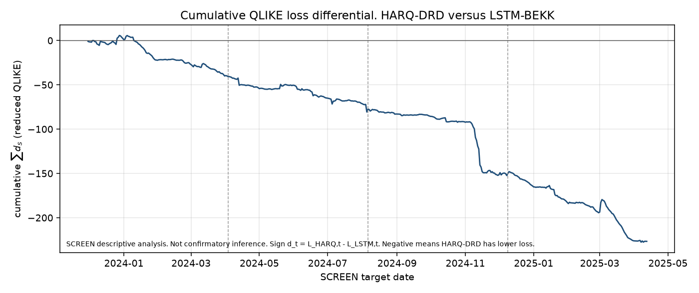
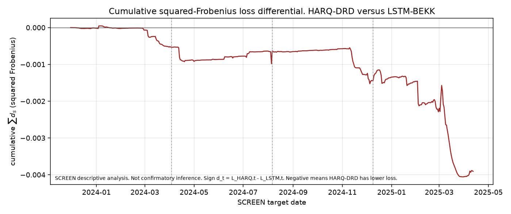

# covharness

`covharness` is a research implementation for one-day-ahead multivariate covariance forecasts. We compare econometric, shallow machine-learning, and deep-learning methods under a common measurement, estimation, and scoring protocol. A new method does not receive a different target, a richer information set, extra tuning, or a more favourable scoring rule because it belongs to a different modelling tradition.

The object of interest is the latent conditional covariance $\Sigma_{t+1\mid t}$. After day $t+1$ ends that matrix is still unobserved, so we score forecasts against a realized-covariance proxy under rules that are fixed before confirmatory evaluation. Whether a difference is large enough to support a claim is decided by pre-specified inferential procedures, not by a ranking of average losses.

Implementation status is in [`docs/PROJECT_STATE.md`](docs/PROJECT_STATE.md). Model contracts are in [`docs/MODEL_IMPLEMENTATION.md`](docs/MODEL_IMPLEMENTATION.md). Inference procedures are in [`docs/INFERENCE_METHODS.md`](docs/INFERENCE_METHODS.md). The U.S.-equity quote path is in [`docs/EQUITY_MEASUREMENT.md`](docs/EQUITY_MEASUREMENT.md). Protocol decisions currently live in [`PREREGISTRATION_DRAFT.md`](PREREGISTRATION_DRAFT.md). That draft is not the final preregistration. The initial core plan is [`INITIAL_CORE_BENCHMARK_PLAN.md`](INITIAL_CORE_BENCHMARK_PLAN.md). It is not a locked roster.

## Current research status

The Binance development period and selection period have been run. Nine of eleven model specifications completed the full 500-day selection period. DCC and DCC-NL failed the frozen admissibility checks and remain in the reported roster. HARQ-DRD was selected as the econometric representative. LSTM-BEKK configuration `LSTM19`, scored as a five-seed equal-weight covariance ensemble, is the current deep-learning representative. Those quantities are interim selection results. They do not establish confirmatory superiority. The 500-day final holdout remains untouched. No confirmatory forecasting, comparison, tuning, or inference has been executed. Broader model, proxy, and economic work remains unfinished.

The long-panel U.S.-equity experiment remains pending because production TAQ access has not yet been established. The one-day 13 February 2009 TAQ extract is a measurement validation panel. LSTM-BEKK-RC, GHAR, and a neural graph covariance model are unimplemented. Global-minimum-variance evaluation is unimplemented. Final `PREREGISTRATION.md` has not been created.

This document describes implemented software, synthetic checks, the executed Binance first-stage, and remaining work. Those layers are not interchangeable.

## Installation and a small example

The project conda environment is `covharness` (Python 3.11). From the repository root

```bash
conda env create -f environment.yml
conda activate covharness
python -m pytest -q
python scripts/synthetic_benchmark_demo.py
```

`environment.yml` installs the package in editable form with the `dev` extra. The demonstration builds a seeded synthetic panel of 3 assets and 8 forecast targets, advances the implemented roster on the 21-origin refit schedule, and prints reduced-QLIKE and squared-Frobenius summaries. It does not download market data, does not write under `results/`, and does not unlock the final holdout. Demonstration hyperparameters are untuned integration settings. The printed tables are not empirical findings.

Inspecting saved Binance artifacts, when they are present locally, is a separate activity from running that example. Reproducing the historical development-period or selection-period fits is a third, expensive activity. Those commands are recorded later and are not part of this quickstart. There is no CI configuration in this repository, so this file does not display CI badges.

## Why covariance forecast evaluation is difficult

The object of interest is

```math
\Sigma_{t+1\mid t} = \mathrm{Cov}(r_{t+1}\mid \mathcal{F}_t).
```

Unlike a fully observed supervised label, this matrix is latent. Forecast evaluation therefore uses an ex-post covariance proxy constructed from higher-frequency observations. That proxy is informative but noisy, so a comparison can be distorted by the choice of proxy, loss, sampling scheme, or inferential procedure.

We therefore fix the measurement pipeline before introducing forecasting models, choose primary losses for use with noisy volatility proxies, and keep confirmatory comparisons separate from model development. The same forecast is also economically relevant because portfolio variance is $`w^{\top}\Sigma_{t+1\mid t}w`$. Statistical loss and later economic evaluation remain separate channels. A lower covariance-space loss is not a claim of profitable trading, Sharpe improvement, or transaction-cost robustness.

---

## Data and forecasting design

Two measurement paths exist in the software. They are not interchangeable. The executed first-stage experiment uses official Binance one-minute spot transaction-bar closes. The U.S.-equity path uses exchange-level TAQ quotes, listing-venue filters, and previous-tick synchronization. That equity path has been exercised on a one-day 2009 extract. Implemented equity subsampling is a TAQ proxy construction, not an executed Binance proxy-robustness study.

### Binance first-stage

The first-stage universe is BTCUSDT, ETHUSDT, BNBUSDT, LTCUSDT, and ADAUSDT. Names were selected by 1m coverage on official `data.binance.vision` monthly archives, not by liquidity ranking after seeing forecast losses. The five-name set is not a representative crypto market and is not survivorship-bias-free. Coverage selection can still omit names that later became important and can retain names that later faded.

A Binance statistical day $t$ is the UTC interval $`[00:00:00,\ 24:00:00)`$. Realized covariance, per-asset realized quarticity, and the daily return all refer to that same 24-hour interval. There is no equity-style separate overnight interval and no 09:30–16:00 session convention.

For retained date $t$, 288 non-overlapping five-minute log returns use the prior-day 23:59 close, then 00:04 through 23:59. The previous UTC day need not itself be a retained statistical day. Missing required endpoints are rejected. There is no forward fill. The unscaled realized covariance is the Gram matrix of those 288 return vectors. Per-asset realized quarticity is

```math
\mathrm{RQ}_{i,t}
=
\frac{M}{3}\sum_{j=1}^{288} r_{i,t,j}^{4}
```

with $M=288$. No annualization, winsorization, clipping, or standardization is applied.

The exchange halt on 2023-03-24 is excluded from the statistical calendar. An available 23:59 close on that date is retained only as the midnight boundary anchor for 2023-03-25. Recursive state and statistical lags must not treat 2023-03-23 and 2023-03-25 as adjacent steps. Packed lags across the halt were rejected.

The production panel has $T=1750$ dates from 2021-11-09 through 2026-08-25, with $N=5$. The local NPZ is gitignored. Measurement definitions are in [`docs/BINANCE_OPEN_DATA_MEASUREMENT_SPEC.md`](docs/BINANCE_OPEN_DATA_MEASUREMENT_SPEC.md). Built-panel checks are in [`docs/BINANCE_OPEN_DATA_PANEL.md`](docs/BINANCE_OPEN_DATA_PANEL.md). The first-stage schedule is in [`docs/BINANCE_OPEN_DATA_PROTOCOL.md`](docs/BINANCE_OPEN_DATA_PROTOCOL.md).

Final-holdout dates were constructed as part of that production panel. Locking the holdout means no confirmatory forecasting or inference has been executed. It does not mean those measurements were never written. The Binance first-stage uses official public kline archives. Public accessibility of klines does not imply a right to redistribute raw files.

### Rolling protocol

The Binance experiment uses `BinanceSegmentedProtocol`. A 250-day development period is used only to choose configurations within each model family. That period is not a training sample in the usual supervised sense. Models are repeatedly estimated on rolling 250-day histories. The 2023-03-24 exchange halt creates a hard break. Models restart from a fresh 250-day post-halt estimation history. A later 500-day selection period compares frozen configurations and selects one econometric and one deep-learning representative. The selection period is not the final test set. The 500-day final holdout remains locked for eventual confirmatory comparison. Its measurements exist in the production panel. Forecasting and inferential use of that holdout remain locked.

The purpose of this separation is to prevent the same observations from being used both to tune a model and to make the final claim. The design is a chronological control. A passing implementation of that control is not a proof that leakage is impossible.

Implementation names appear once here so that code, YAML, and artifacts can be matched to the research periods.

| Research period | Implementation name | Inclusive UTC dates | Count | Role |
| --- | --- | --- | ---: | --- |
| Development-period estimation history | `HISTORY_A` | 2021-11-09 through 2022-07-16 | 250 | burn-in before configuration choice |
| Development period | `VALIDATION` | 2022-07-17 through 2023-03-23 | 250 | within-family configuration choice |
| Post-halt estimation history | `HISTORY_B` | 2023-03-25 through 2023-11-29 | 250 | burn-in after the halt |
| Selection period | `SCREEN` | 2023-11-30 through 2025-04-12 | 500 | frozen-candidate comparison |
| Final holdout | `CONFIRM` | 2025-04-13 through 2026-08-25 | 500 | locked confirmatory sample |

The development calendar is never concatenated with the post-halt selection and holdout calendar.

Every origin precedes its target by one UTC calendar day. The estimation window is $m=250$ admissible statistical dates through the origin, excluding the next target. Forecasts are formed at every origin. Parameters are refit every 21 forecast origins. The first target in each evaluation period has `refit=True`. The refit counter resets at the start of the development period, the selection period, and the final holdout. Between refits, observable state is updated daily. Parameter refit, state update, and forecast formation are distinct operations. The same origin never receives both `fit` and a subsequent `update`.

Selection-period observations become legitimate history after they are observed. A later selection or holdout origin may include earlier selection dates in its 250-day window. Whole-period advance access is forbidden. The holdout's first refit uses the last 250 selection dates as history. No fitted selection-period object needs to be carried forward.

The generic `TemporalProtocol` used in synthetic tests has the same $m=250$ window, 21-origin cadence, and default holdout lock. Retrieving holdout dates raises `ConfirmLockedError` unless `unlock_confirm=True` is passed. Scalers are fit on the estimation window through $t$ only. The development period is the only period used for configuration choice. The selection period compares frozen candidates.

### Equity measurement path

The equity path starts from quotes rather than Binance bar closes. Cleaning precedes synchronization because an invalid quote immediately before a grid time becomes the previous-tick price, and realized covariance is a quadratic form of those synchronized returns. Listing venue and TAQ suffix identity matter. Previous-tick synchronization assigns, at each grid time, the most recent valid price at or before that time. Future observations are never used for interpolation.

Five-minute realized covariance is the equity baseline. Five-minute subsampling is implemented as a complementary equity proxy. It was not the Binance selection-period target. The Epps effect motivates measurement diagnostics. Calendar-time realized covariance records co-movement only when two assets update inside the same sampling interval, so a finer grid is not automatically a better covariance label. We keep unscaled calendar-time $\mathrm{RCov}$ as the baseline proxy and use the frequency scan as a diagnostic rather than as a search for a true matrix.

On 13 February 2009 the five-stock single-exchange panel is a one-day demonstration, not an estimate of the magnitude of the Epps effect in U.S. equities. The heavy line is the average off-diagonal correlation. The light lines are the ten unique pairs. The long-panel U.S.-equity experiment remains pending because production TAQ access has not yet been established.


Quote rules, listing-venue mapping, the JPM identity case, subsampled-grid construction, WRDS table paths, and the exact Epps diagnostic reports are in [`docs/EQUITY_MEASUREMENT.md`](docs/EQUITY_MEASUREMENT.md).

---

## Scoring a latent covariance target

After the day has ended we still do not observe $\Sigma_{t+1\mid t}$. Evaluation uses a realized-covariance proxy $S$ in place of that matrix. With a conditionally unbiased proxy, $`\mathrm{E}[S\mid\mathcal{F}]=\Sigma`$, ranking forecasts by a robust loss agrees with ranking them against the latent target (Patton, 2011; Laurent, Rombouts, and Violante, 2013). Those ranking arguments require the stated unbiasedness and loss-robustness conditions. Choosing QLIKE and squared Frobenius does not prove that the Binance proxy satisfies them. The losses below are fixed before confirmatory evaluation.

The adopted Frobenius ranking loss is the squared distance

```math
L_F(S,H)
=\|S-H\|_F^2
=\mathrm{tr}\bigl((S-H)^{\top}(S-H)\bigr)
=\sum_{ij}(S_{ij}-H_{ij})^2.
```

This is the matrix analogue of mean squared error. If $`\mathrm{E}[S\mid\mathcal{F}]=\Sigma`$, then

```math
\mathrm{E}\bigl[\|S-H\|_F^2\bigr]
=\|\Sigma-H\|_F^2
+\mathrm{E}\bigl[\|S-\Sigma\|_F^2\bigr].
```

The second term does not depend on the forecast. Taking the square root destroys that decomposition, so ordinary unsquared Frobenius is a labeled non-robust contrast only. PSD is not required merely to compute the squared loss.

The primary ranking loss is reduced multivariate QLIKE

```math
L_Q(S,H)
=\log\det(H)+\mathrm{tr}(H^{-1}S).
```

$S$ must be square, finite, symmetric, and PSD. It may be singular. $H$ must be strictly PD. The implementation factorizes $H=LL^{\top}$ by Cholesky and uses that same factor for $`\log\det(H)=2\sum_i\log L_{ii}`$ and for the solves that compute $`\mathrm{tr}(H^{-1}S)`$. It does not form $H^{-1}$. A failed Cholesky is the positive-definiteness failure. The loss does not repair a forecast.

When both $S$ and $H$ are SPD,

```math
L_S(S,H)
=\mathrm{tr}(H^{-1}S)-\log\det(H^{-1}S)-N
=L_Q(S,H)-\log\det(S)-N.
```

Reduced QLIKE and full Stein are not numerically equal. For a common SPD target they differ only by a target-only term, so rankings and pairwise differentials agree. Full Stein therefore does not supply another independent ranking test. Full Stein rejects a singular $S$. Rank deficiency of the proxy does not by itself prevent evaluation with squared Frobenius or reduced QLIKE, but it can increase proxy noise.

Variance-versus-correlation localization reports $`\sum_i(S_{ii}-H_{ii})^2`$ and $`\|R(S)-R(H)\|_F^2`$. These diagnostics are descriptive. They are not an additive decomposition of the ranking losses and do not inherit the ranking-consistency guarantee of covariance-space Frobenius and QLIKE.

The proxy-robustness construction $S=u\Sigma$ with $`u\sim\mathrm{Exp}(1)`$ is in `covharness.losses.robustness`. $H_A=\Sigma$ ranks above the median-matched $`H_B=\log(2)\Sigma`$ in expected squared Frobenius, reduced QLIKE, and full Stein. Ordinary unsquared Frobenius ranks $H_B$ first.


Report QLIKE differences, not percentage QLIKE improvements. A percentage reduction in squared-Frobenius loss is not a percentage reduction in portfolio risk.

---

## Forecasting models

The common forecast contract is `covharness.models.CovarianceModel`. Rolling behavior is declared by `ModelCapabilities`. At a refit origin the runner fits on the current $m=250$ window through $t$ and then forecasts. At a non-refit origin it advances daily state once, then forecasts. Forecast generation and evaluation remain separate. $H_{t+1\mid t}$ is scored against $S_{t+1}$. Exact recursions, estimators, and validity checks are in [`docs/MODEL_IMPLEMENTATION.md`](docs/MODEL_IMPLEMENTATION.md).

The executed Binance design has seven fixed specifications and four 20-configuration grids, recorded in [`configs/binance_open_data_core.yaml`](configs/binance_open_data_core.yaml). That is not an identical search or identical compute budget for every family. RW, HAR-DRD, HARQ-DRD, LW-linear, LW-NL, DCC, and DCC-NL each have one frozen mathematical definition. EWMA searches 20 decay values. Ridge-DRD searches 20 shared $\lambda$ values, including $\lambda=0$. XGBoost-DRD searches four capacity settings times five regularization settings. LSTM-BEKK searches five architecture/training settings times four optimizer settings. Stochastic LSTM candidates are trained on seeds $(0,1,2,3,4)$. All five seeds are retained. Best-seed selection is forbidden.

Reporting rows are not 187 independent experiments. The recorded accounting is 67 deterministic candidate trajectories, 100 LSTM seed trajectories, and 20 derived LSTM covariance ensembles. Seed covariance matrices are averaged before scoring. An ensemble that scores better than every seed is an observed result, not a general guarantee.

The current daily-return LSTM and realized-measure HARQ do not have matched information sets. The selection-period comparison therefore does not isolate architecture from information advantage.

| Family | Inputs | Binance specification | Selection-period status | Implementation |
| --- | --- | --- | --- | --- |
| RW | RCov cube | RW01, fixed | complete, 500 targets | [`random_walk.py`](src/covharness/models/random_walk.py) |
| EWMA | RCov cube | EWMA01, $\lambda=0.8000$ from the 20-point grid | complete, 500 targets | [`ewma.py`](src/covharness/models/ewma.py) |
| HAR-DRD | RCov cube | HARDRD01, fixed | complete, 500 targets | [`har_drd.py`](src/covharness/models/har_drd.py) |
| HARQ-DRD | RCov cube and per-asset RQ | HARQDRD01, fixed | complete, 500 targets, 2 recorded fallbacks | [`harq_drd.py`](src/covharness/models/harq_drd.py) |
| LW-linear | daily returns | LWLIN01, fixed | complete, 500 targets | [`ledoit_wolf.py`](src/covharness/models/ledoit_wolf.py) |
| LW-NL | daily returns | LWNL01, fixed | complete, 500 targets | [`ledoit_wolf.py`](src/covharness/models/ledoit_wolf.py) |
| DCC | daily returns | DCC01, fixed | failed at origin 2023-12-20 | [`dcc.py`](src/covharness/models/dcc.py) |
| DCC-NL | daily returns | DCCNL01, fixed | failed at the same origin | [`dcc.py`](src/covharness/models/dcc.py) |
| Ridge-DRD | RCov cube | RIDGE01, $\lambda=0$ from the 20-point grid | complete, exact HAR-DRD loss tie | [`ridge_drd.py`](src/covharness/models/ridge_drd.py) |
| XGBoost-DRD | RCov cube | XGB08 from the 20-point grid | complete, 500 targets | [`xgboost_drd.py`](src/covharness/models/xgboost_drd.py) |
| LSTM-BEKK | daily returns | LSTM19, seeds 0–4, equal-weight covariance ensemble | complete, 500 targets | [`lstm_bekk.py`](src/covharness/models/lstm_bekk.py) |

A zero complete-support count means that family did not supply an admissible complete selection-period trajectory under the frozen rules. It is not proof that no earlier forecast or fit was ever produced.

### Realized-measure models

Random walk maps $H_{t+1\mid t}=S_t$. EWMA recurses on the realized-covariance sequence with frozen decay $\lambda$. The Binance development period selected $\lambda=0.8000$.

HAR-DRD splits each realized covariance into variances and correlations, then forecasts both with Zhang-style non-overlapping daily, weekly (four observations), and monthly (seventeen observations) lags. Variances have asset-specific intercepts and three shared slopes. Correlations have pair-specific intercepts and three shared slopes. Between coefficient refits, origin $1/4/17$ features are rebuilt from the current 250-day window. If the raw reconstruction fails an explicit validity filter, the headline forecast is the arithmetic mean of that current origin window. Evaluation itself performs no repair.

HARQ-DRD adds one daily per-asset quarticity interaction $`\sqrt{\mathrm{RQ}_{i,t-1}}\,v_{i,t-1}`$ on the variance equation. Realized quarticity is informative about measurement error in realized variance. The correlation map remains the HAR-DRD object. The same recorded estimation-window-mean fallback applies. The selection period does not identify that interaction as the cause of HARQ's selection.

Ridge-DRD keeps the HAR information set and regularizes the three shared slopes. The case $\lambda=0$ nests the implemented HAR-DRD OLS problem. The Binance development period selected RIDGE01 with $\lambda=0$, and the saved selection-period losses coincide with HAR-DRD.

XGBoost-DRD is the next step on that controlled ladder. Targets, $1/4/17$ lags, group structure, and repair remain those of HAR and Ridge. The linear learner is replaced by exactly two pooled squared-error boosters, with no asset or pair identity feature. The headline configuration is deterministic. The Binance development period selected XGB08.

### Daily-return covariance models

Standalone Ledoit–Wolf estimators consume daily returns, not realized-covariance histories. Linear shrinkage applies one affine map to every sample eigenvalue toward $\mu I$. Nonlinear shrinkage uses eigenvalue-specific corrections from the analytical 2020 estimator. Sample eigenvectors are retained. These standalone estimators are distinct from DCC-NL targeting. Both follow the common 21-origin refit cadence. Between refits the stored covariance is held unchanged.

DCC and DCC-NL are original Engle (2002) DCC, not Aielli cDCC. Stage one is univariate GARCH. Stage two is a dynamic correlation recursion. DCC-NL changes only the correlation intercept through analytical nonlinear shrinkage of standardized residuals. Parameters are re-estimated every 21 origins. Between those refits, GARCH and $Q$ states update daily. Accepted GARCH fits must satisfy $a+b<1$. On this selection panel both identities failed at origin 2023-12-20 when a univariate fit reached $a=0$, $b=1$. That failure was reported and not replaced.

### Deep-learning competitor

LSTM-BEKK is a daily-return model. In internal percent units the recursion is scalar BEKK plus an LSTM-generated dynamic intercept

```math
H_t = CC^{\top} + C_t C_t^{\top} + a x_{t-1}x_{t-1}^{\top} + b H_{t-1}.
```

$C$ and $C_t$ are lower triangular, so $CC^{\top}$ and $C_tC_t^{\top}$ are Gram matrices. With $a,b\ge 0$, every term is positive semidefinite. Strict positive definiteness is anchored by a strictly positive diagonal on static $C$. This is not a generic black-box LSTM mapped onto a covariance matrix, and it is not full Engle–Kroner matrix $A,B$. The model does not consume realized covariance or RQ. Hidden and $H$ states update daily between 21-origin retraining. The selection period scores the equal-weight mean of five seed covariance matrices. Rolling estimation at $N=100$ or $N=200$ with $T=250$ remains a computing limitation. LSTM-BEKK-RC is unimplemented.

---

## Statistical evaluation

A lower average loss is not enough to establish superiority. Loss differentials can be serially dependent, so a long streak of wins is not independent evidence. Several procedures are implemented and synthetically tested. Only SPA and MCS were executed on the Binance selection period. Pairwise Diebold–Mariano, Giacomini–White, Mincer–Zarnowitz, and Giacomini–Rossi tests were not run on that sample. Confirmatory pairwise inference remains unresolved. Implementation contracts are in [`docs/INFERENCE_METHODS.md`](docs/INFERENCE_METHODS.md).

### Pairwise comparison

Diebold–Mariano asks whether the mean pairwise loss differential is zero. For forecasts A and B,

```math
d_t = L_{A,t} - L_{B,t},\qquad
\mathrm{DM}=\frac{\bar d}{\widehat{\mathrm{se}}_{\mathrm{HAC}}(\bar d)}.
```

The current baseline uses Bartlett / Newey–West HAC standard errors and an $N(0,1)$ reference. It is a forecast-comparison statement, not a proof that one population model is true. A candidate recentered stationary-bootstrap mean test is implemented and remains under synthetic calibration. It has not been adopted for confirmatory reporting. Clark–West is restricted to nested scalar squared-error forecasts.

### Multiple-model screening

SPA asks whether any alternative in a finite universe beats a supplied benchmark. The selection-period benchmark is HAR-DRD. The studentized statistic is

```math
T_n^{\mathrm{SPA}}
=\max\Bigl(0,\ \max_k n^{1/2}\bar d_k/\hat\omega_k\Bigr).
```

A small p-value means some alternative beats the benchmark. It is not a HARQ-versus-LSTM pairwise p-value. An identically zero benchmark differential is labeled `exact_benchmark_tie` and is excluded only from SPA studentization.

MCS returns a set of models that cannot be distinguished from the best under a chosen Hansen–Lunde–Nason procedure. Membership is not a probability that a particular model is best. The primary selection-period specification is $`(T_R,e_R)`$ at $\alpha=0.10$. The companion is $`(T_{\max},e_{\max})`$. The two pairs are never crossed.

### Conditional and local diagnostics

Giacomini–White tests conditional predictive ability. It asks whether origin-known instruments predict the loss differential. Mincer–Zarnowitz tests forecast calibration through a pooled-vech regression of unique covariance entries on the forecast. Giacomini–Rossi studies time-local instability of relative performance. These procedures exist in the harness and have been synthetically tested. They were not executed on the Binance selection period.

### Selection rule for the frozen comparison

The headline comparison remains one deep-learning representative versus one econometric representative. Econometric eligible families are RW, EWMA, HAR-DRD, HARQ-DRD, LW-linear, LW-NL, DCC, and DCC-NL. Ridge-DRD and XGBoost-DRD participate in SPA, MCS, and robustness tables. They cannot occupy the econometric headline slot. LSTM-BEKK is the only first-stage deep model, so LSTM19 is the deep-learning representative by construction.

Primary reduced QLIKE is the only headline selection channel. The 500 selection-period targets are partitioned into four chronological 125-day subperiods. Complete econometric models are ranked within each subperiod. Lower mean QLIKE receives a better rank. Exact subperiod-mean ties receive average ranks. The rule selects the lowest median of the four subperiod ranks, then the lowest mean of those ranks, then the lexicographically smaller family ID. Full-period mean QLIKE is a robustness leader only. Squared Frobenius does not select. MCS membership annotated the selected representatives. It did not restrict the econometric pool to MCS survivors.

---

## Planned economic evaluation

A statistically more accurate covariance forecast need not produce a lower-risk portfolio. The broader plan therefore includes a separate global-minimum-variance evaluation. For a covariance forecast $\widehat{\Sigma}_t$, the unconstrained GMV weights are

```math
w_t
= \frac{\widehat{\Sigma}_t^{-1}\mathbf{1}}
{\mathbf{1}^{\top}\widehat{\Sigma}_t^{-1}\mathbf{1}}.
```

The planned analysis will compare realized portfolio variance and, in later stages, turnover and transaction costs. Primary economic risk on the equity path will include the overnight outer product. Open-to-close-only GMV remains a robustness channel. This channel is separate from covariance-space forecast loss because portfolio construction depends on the precision matrix $`\widehat{\Sigma}_t^{-1}`$. Covariance-loss selection results are not economic value.

---

## Interim Binance selection results

These quantities are out-of-sample selection diagnostics on the five-asset Binance panel. They are not confirmatory rankings. Numbers below are taken from the saved artifacts. The locked final holdout 2025-04-13 through 2026-08-25 has not been opened.

Calendar. 500 selection-period targets from 2023-11-30 through 2025-04-12, with 24 parameter refits. Four chronological 125-day subperiods. The first 125-day subperiod is 2023-11-30 through 2024-04-02. The second is 2024-04-03 through 2024-08-05. The third is 2024-08-06 through 2024-12-08. The final 125-day subperiod is 2024-12-09 through 2025-04-12.

Nine specifications produced complete selection-period trajectories. DCC and DCC-NL failed at origin 2023-12-20, the second selection-period refit, because ZeroMean GARCH(1,1) for asset 1 returned $`\omega\approx 4.966\times 10^{-12}`$, $a=0$, $b=1$, which violates $a+b<1$. No substitute specification was introduced. SPA and MCS used the nine complete columns. DCC and DCC-NL are not described as statistically inferior. They did not supply an admissible complete trajectory.

HAR-DRD and RIDGE01 have identical saved QLIKE series and identical squared-Frobenius series. The saved summary still lists distinct `argsort` ordinal positions for those two families. That display artifact is not evidence of different performance. Public tables below omit those ordinal ranks. The original CSV is preserved.

HARQ-DRD recorded two estimation-window-mean fallbacks. The selection-period checkpoint flags locate targets 2024-12-10 (origin 2024-12-09, position 376, `refit=False`) and 2025-03-03 (origin 2025-03-02, position 459, `refit=False`). Both sit in the final 125-day subperiod. Saved diagnostics record `repair_count=2` and do not identify which raw-forecast validity condition failed. We do not invent an eigenvalue, variance, or optimization explanation.

Mean losses from [`results/binance_screen_model_summary.csv`](results/binance_screen_model_summary.csv).

| Family | ID | Complete support | Mean QLIKE | Mean $L_F^2$ | Notes |
| --- | --- | ---: | ---: | ---: | --- |
| RW | RW01 | 500 | -31.270726 | $`1.078193\times 10^{-4}`$ | complete |
| EWMA | EWMA01 | 500 | -31.776804 | $`7.800251\times 10^{-5}`$ | complete |
| HAR-DRD | HARDRD01 | 500 | -31.759431 | $`7.489333\times 10^{-5}`$ | exact tie with RIDGE01 |
| HARQ-DRD | HARQDRD01 | 500 | -31.862063 | $`7.487763\times 10^{-5}`$ | selected econometric representative, 2 fallbacks |
| LW-linear | LWLIN01 | 500 | -30.235152 | $`9.262341\times 10^{-5}`$ | complete |
| LW-NL | LWNL01 | 500 | -30.162208 | $`9.202238\times 10^{-5}`$ | complete |
| DCC | DCC01 | 0 |  |  | failed, IGARCH boundary |
| DCC-NL | DCCNL01 | 0 |  |  | failed, same origin |
| Ridge-DRD | RIDGE01 | 500 | -31.759431 | $`7.489333\times 10^{-5}`$ | $\lambda=0$ nested HAR, exact tie |
| XGBoost-DRD | XGB08 | 500 | -31.711532 | $`7.856037\times 10^{-5}`$ | complete, not the econometric headline |
| LSTM-BEKK | LSTM19 | 500 | -31.408752 | $`8.269241\times 10^{-5}`$ | selected deep-learning representative by construction |

The QLIKE comparison separated the methods more sharply than the squared-Frobenius comparison. HARQ-DRD has the lowest full-period mean QLIKE among complete models. Its mean QLIKE differential versus the LSTM ensemble is $-0.453310$. The corresponding mean squared-Frobenius differential is $`-7.814785\times 10^{-6}`$, a 9.450 percent reduction using the LSTM ensemble mean as denominator. That 9.450 percent figure is a descriptive reduction in squared-Frobenius loss. It has not been established as a statistically significant pairwise Frobenius improvement, and it is not a percentage reduction in portfolio risk.

The HARQ-minus-LSTM mean QLIKE differential is negative in all four frozen 125-day subperiods. Negative subperiod means do not mean HARQ wins every date, every regime, or four independent tests. HARQ has lower QLIKE on 69.6 percent of selection-period dates. Approximately 63.1 percent of the cumulative squared-Frobenius advantage versus LSTM is in the final 125-day subperiod.

EWMA has lower mean QLIKE than HARQ in the first and third 125-day subperiods. HARQ and EWMA tie on median rank 2.0 among the six complete eligible econometric families. HARQ is selected by mean rank 1.75 versus 2.00.

Hansen SPA versus HAR-DRD, $B=5000$, seed 20260913, $\ell=7$, consistent recentering. QLIKE statistic 3.001, consistent p-value 0.0016. Squared-Frobenius statistic 0.0102, consistent p-value 0.8792. RIDGE01 is an exact benchmark tie on both channels. The QLIKE p-value records that some alternative, here HARQ-DRD, beats the HAR-DRD benchmark on the selection period. It is not a HARQ-versus-LSTM pairwise test.

Primary QLIKE MCS $`(T_R,e_R)`$ at $\alpha=0.10$ retains EWMA and HARQ-DRD. LSTM-BEKK has p-value 0.001 and is outside that set. Primary squared-Frobenius MCS at the same level includes RW, EWMA, HAR-DRD, HARQ-DRD, Ridge-DRD, XGBoost-DRD, and LSTM-BEKK. LSTM-BEKK has Frobenius MCS p-value 0.1244. Companion $`(T_{\max},e_{\max})`$ results are stored in the MCS artifacts and are not substituted for the primary procedure.

LSTM19 seeds 0 through 4 all completed. Seed mean QLIKE values are $-31.258560$, $-31.289213$, $-31.211141$, $-31.351885$, and $-31.286159$. The range is $[-31.351885,-31.211141]$ and the sample standard deviation is $0.051210$. The ensemble mean QLIKE is $-31.408752$, lower than every seed mean because the reported column averages covariance matrices before scoring. Seeds are repeated training draws of one configuration, not five independent markets.

Recorded family forecasting times in the selection summary sum to about 4968 seconds and are dominated by LSTM-BEKK at 4919.511 seconds. A later resume that wrote SPA, MCS, and reporting tables took 2.977 seconds. That resume is not total selection-period runtime. Fitting time is not prediction latency. An unavailable single end-to-end wall-clock figure should not be replaced by the resume time.

The figures below are selection-period cumulative loss differentials, not cumulative portfolio returns. The sign convention is HARQ minus the comparator. Negative values favour HARQ. The saved image files retain the internal `SCREEN` label in their filenames.





The interpretation note is [`results/binance_screen_interpretation.md`](results/binance_screen_interpretation.md). Effect sizes are [`results/binance_screen_effect_sizes.csv`](results/binance_screen_effect_sizes.csv). Loss panels, forecasts, and checkpoints are local NPZ files. They are gitignored and are not public GitHub artifacts.

This experiment did not complete the conventional frontier, the deep-learning frontier, or an information-matched comparison. GHAR does not satisfy the neural graph-model commitment.

---

## Limitations and remaining research

The first-stage Binance core is $N=5$ and one unscaled five-minute realized-covariance proxy. [`INITIAL_CORE_BENCHMARK_PLAN.md`](INITIAL_CORE_BENCHMARK_PLAN.md) still records a broader TIER 1 design with $N=30$ and two equity proxies. Those documents disagree. The executed first-stage does not replace the broader plan, and the plan does not rewrite what was actually run.

Unresolved or unimplemented work includes LSTM-BEKK-RC, GHAR as a structured graph / econometric baseline, a genuinely neural graph covariance model, Binance proxy robustness, the confirmatory inference decision, and full economic evaluation. Realized kernels, cDCC, and daily-moving-window Ledoit–Wolf are unimplemented.

The long-panel U.S.-equity experiment remains pending because production TAQ access has not yet been established. A passing unit-test suite supports the tested behaviours. It does not prove the absence of leakage, certify the repository as bug-free, or complete the paper. Software completion is not paper completion. Model selection is not final confirmation. Covariance-loss rankings are not economic value.

---

## Reproduction and artifacts

Three activities remain separate.

**Tests and the synthetic demonstration.** Use the installation commands above. They do not require market data.

**Inspecting available empirical artifacts.** JSON, CSV, and Markdown tables under `results/` can be read without refitting. The production panel NPZ, selection-period forecast NPZ, loss-panel NPZ files, and checkpoints are local. They are gitignored. A local file is not a GitHub-visible artifact until it is tracked.

**Reproducing expensive historical empirical runs.** The following commands rebuild the development period or the selection period from the frozen configurations. They are documented and are not part of the default quickstart.

```bash
python scripts/run_binance_validation.py
python scripts/run_binance_screen.py
```

Those script names retain the implementation labels. Do not include holdout unlocking in routine use. There is no authorized confirmatory runner in the default path.

---

## Repository structure and extending the harness

```text
covharness/
├── AGENTS.md
├── README.md
├── INITIAL_CORE_BENCHMARK_PLAN.md
├── PREREGISTRATION_DRAFT.md
├── pyproject.toml
├── environment.yml
├── docs/
│   ├── PROJECT_STATE.md
│   ├── MODEL_IMPLEMENTATION.md
│   ├── INFERENCE_METHODS.md
│   ├── EQUITY_MEASUREMENT.md
│   ├── EMPIRICAL_DATA_FEASIBILITY.md
│   ├── OPEN_DATA_FEASIBILITY.md
│   ├── BINANCE_OPEN_DATA_MEASUREMENT_SPEC.md
│   ├── BINANCE_OPEN_DATA_PANEL.md
│   ├── BINANCE_OPEN_DATA_PROTOCOL.md
│   └── project_ledger.md
├── src/covharness/
│   ├── data/
│   ├── realized/
│   ├── simulation/
│   ├── features/
│   ├── models/
│   ├── losses/
│   ├── evaluation/
│   ├── inference/
│   ├── portfolio/
│   ├── protocol/
│   ├── diagnostics/
│   └── utils/
├── configs/
├── tests/unit/
├── scripts/
├── experiments/
├── notebooks/
└── results/
```

Reusable implementation belongs under `src/covharness/`. Scripts are entry points. They are not a second implementation.

A future model joins the common contract rather than a parallel scoring path. Implement `CovarianceModel` or `RealizedCovarianceModel` with a frozen `ModelIdentity` and class-level `ModelCapabilities`. Supply `fit` on the origin window, `forecast` as an independent $(N,N)$ copy, and `update` or `update_window` according to the declared cadence. Models do not inspect protocol period labels, repair invalid matrices silently, or compute losses internally. Evaluation remains `covharness.evaluation` against the target-date proxy.

---

## Research integrity

The benchmark preserves chronological development, selection, and confirmation ordering. Preprocessing is fit only on information available at the origin. Future observations are excluded from feature construction. Tuning budgets and re-estimation schedules are comparable across families, with the actual search recorded rather than described as identical compute. Stochastic methods use explicit seeds and report the full seed distribution. The final holdout is not used for tuning. Failed configurations are retained. Invalid covariance matrices are not repaired without recording the failure and the method. Evaluation proxies and losses are fixed before confirmation. Confirmatory claims rest on pre-specified inferential procedures rather than on rankings of average loss alone.

Specific leakage controls include origin windows that exclude the target, train-only scalers, a default holdout lock, segmented Binance calendars that do not pack lags across the 2023-03-24 halt, and tests that request holdout dates without `unlock_confirm=True` and expect `ConfirmLockedError`. A passing test suite supports those tested behaviours. It does not prove the absence of leakage.

Simulation is required to validate estimators, losses, and inference against known truth before relying on market data. Simulation never substitutes for the project's final empirical finding.

---

## References

- Andersen, T. G., & Bollerslev, T. (1998). *Answering the Skeptics: Yes, Standard Volatility Models Do Provide Accurate Forecasts.* International Economic Review.
- Epps, T. W. (1979). *Comovements in stock prices in the very short run.* Journal of the American Statistical Association, 74(366), 291–298.
- Barndorff-Nielsen, O. E., & Shephard, N. (2006). *Econometrics of Testing for Jumps in Financial Economics Using Bipower Variation.* Journal of Financial Econometrics.
- Barndorff-Nielsen, O. E., Hansen, P. R., Lunde, A., & Shephard, N. (2009). *Realised kernels in practice: trades and quotes.* The Econometrics Journal, 12(3), C1–C32.
- Barndorff-Nielsen, O. E., Hansen, P. R., Lunde, A., & Shephard, N. (2011). *Multivariate realised kernels: consistent positive semi-definite estimators of the covariation of equity prices with noise and non-synchronous trading.* Journal of Econometrics, 162(2), 149–169.
- Diebold, F. X., & Mariano, R. S. (1995). *Comparing Predictive Accuracy.* Journal of Business & Economic Statistics.
- Hansen, P. R. (2005). *A Test for Superior Predictive Ability.* Journal of Business & Economic Statistics.
- Hansen, P. R., Lunde, A., & Nason, J. R. (2011). *The Model Confidence Set.* Econometrica.
- Newey, W. K., & West, K. D. (1987). *A Simple, Positive Semi-Definite, Heteroskedasticity and Autocorrelation Consistent Covariance Matrix.* Econometrica.
- Newey, W. K., & West, K. D. (1994). *Automatic Lag Selection in Covariance Matrix Estimation.* The Review of Economic Studies.
- Clark, T. E., & West, K. D. (2007). *Approximately Normal Tests for Equal Predictive Accuracy in Nested Models.* Journal of Econometrics.
- Engle, R. F. (2002). *Dynamic Conditional Correlation.* Journal of Business & Economic Statistics.
- Engle, R. F., & Colacito, R. (2006). *Testing and Valuing Dynamic Correlations for Asset Allocation.* Journal of Business & Economic Statistics.
- Engle, R. F., Ledoit, O., & Wolf, M. (2019). *Large Dynamic Covariance Matrices.* Journal of Business & Economic Statistics.
- Giacomini, R., & Rossi, B. (2010). *Forecast Comparisons in Unstable Environments.* Journal of Applied Econometrics.
- Giacomini, R., & White, H. (2006). *Tests of Conditional Predictive Ability.* Econometrica.
- Laurent, S., Rombouts, J. V. K., & Violante, F. (2013). *On Loss Functions and Ranking Forecasting Performances of Multivariate Volatility Models.* Journal of Applied Econometrics.
- Ledoit, O., & Wolf, M. (2004). *A Well-Conditioned Estimator for Large-Dimensional Covariance Matrices.* Journal of Multivariate Analysis.
- Ledoit, O., & Wolf, M. (2020). *Analytical Nonlinear Shrinkage of Large-Dimensional Covariance Matrices.* Annals of Statistics.
- Patton, A. J. (2011). *Volatility Forecast Comparison Using Imperfect Volatility Proxies.* Journal of Econometrics.
- Patton, A. J., & Sheppard, K. (2009). *Evaluating Volatility and Correlation Forecasts.* In T. G. Andersen, R. A. Davis, J.-P. Kreiss, and T. Mikosch (Eds.), *Handbook of Financial Time Series.* Springer.

---

## License and data

MIT License. See [`LICENSE`](LICENSE). Raw market data may be subject to vendor licensing restrictions and are not committed to the repository. Public accessibility of a data source is not a redistribution right.
