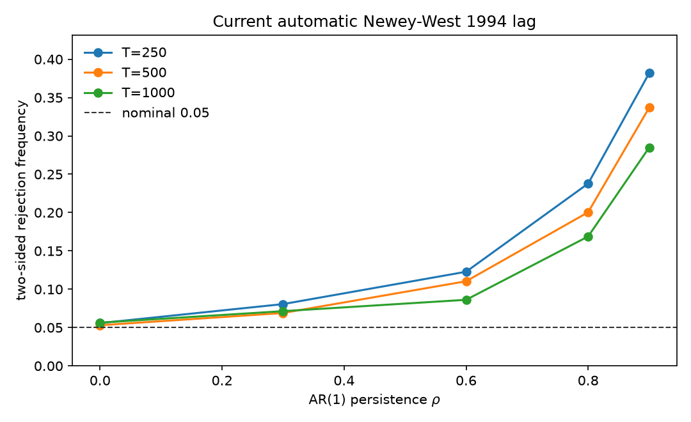
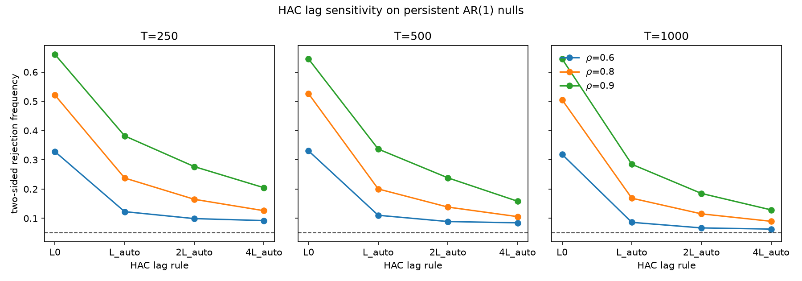

# Inference methods

This document records the implemented forecast-comparison procedures. The public research narrative is [`README.md`](../README.md). Binance SCREEN executed SPA and MCS only. Pairwise Diebold–Mariano, Giacomini–White, Mincer–Zarnowitz, and Giacomini–Rossi tests were not run on SCREEN. Confirmatory pairwise inference remains unresolved. The completed Newey–West Diebold–Mariano calibration and the calibrated-but-unadopted bootstrap candidate are not a settled confirmatory default.

Sign convention. $d_t=L_{A,t}-L_{B,t}$. Then $d_t<0$ means A has lower loss on date $t$.

---

## Diebold–Mariano with Newey–West HAC

Source `covharness.inference.dm` and `covharness.inference.hac`.

The implemented pairwise test asks whether the mean loss differential is zero. It is a forecast-comparison statement, not a proof that one population model is the true model.

```math
\mathrm{DM}=\frac{\bar d}{\widehat{\mathrm{se}}_{\mathrm{HAC}}(\bar d)}.
```

The HAC estimator uses the Bartlett kernel $k(j)=1-j/(L+1)$ and the Newey–West (1994) lag $L=\lfloor 4(T/100)^{2/9}\rfloor$, with an optional explicit lag. Autocovariances use the $1/T$ divisor on the demeaned series. Long-run variance is $\hat\omega=\hat\gamma_0+2\sum_{j=1}^L k(j)\hat\gamma_j$. $L=0$ is the heteroskedasticity-only case. If every supplied differential observation is exactly equal, HAC and Diebold–Mariano are undefined and `DegenerateLossDifferentialError` is raised before demeaning. Constancy is not inferred from a variance floor. A genuinely nonconstant series with small variance remains valid. A non-finite HAC long-run variance is rejected rather than stored. A numerically tiny negative long-run variance is treated as zero and then rejected as degenerate. No jitter is added. p-values use the asymptotic $N(0,1)$ reference. The Harvey–Leybourne–Newbold small-sample correction is not applied because the design has not committed to it.

The intercept-only HAC standard error matches statsmodels OLS with `cov_type='HAC'`, Bartlett kernel, and `use_correction=False`.

That automatic Bartlett / Newey–West procedure remains the current baseline. The lag rule was not changed after the synthetic sensitivity study. Persistent mean-zero AR(1) differentials can produce finite-sample over-rejection, and the HAC long-run variance can understate the true AR(1) long-run variance $1/(1-\rho)^2$. The expanded calibration in `scripts/dm_hac_calibration_sensitivity.py` is synthetic. It uses common random numbers across $L=0$, $L_{\mathrm{auto}}$, $2L_{\mathrm{auto}}$, and $4L_{\mathrm{auto}}$. No bandwidth was selected from those cells. No new default has been adopted.

A fixed-seed demonstration of naive $t$-test over-rejection versus HAC DM is in [`notebooks/dm_hac_size.ipynb`](../notebooks/dm_hac_size.ipynb) and [`results/dm_hac_size.png`](../results/dm_hac_size.png). The expanded synthetic size grid is stored in [`results/dm_hac_calibration_sensitivity.csv`](../results/dm_hac_calibration_sensitivity.csv), with descriptive figures [`results/dm_hac_calibration_size_vs_rho.png`](../results/dm_hac_calibration_size_vs_rho.png) and [`results/dm_hac_calibration_bandwidth.png`](../results/dm_hac_calibration_bandwidth.png).






Diagnostics for a headline pair are the cumulative sum $C_t=\sum_{s\le t}d_s$, the sample ACF of $d_t$, the HAC inflation $\kappa=\hat\omega/\hat\gamma_0$, and $T_{\mathrm{eff}}=T/\kappa$ when those ratios are defined. $T_{\mathrm{eff}}$ is not clipped into $[1,T]$. Under negative serial correlation $\kappa$ can be below one and $T_{\mathrm{eff}}$ can exceed $T$.

---

## Stationary-bootstrap pairwise companion

Source `covharness.inference.bootstrap_mean`.

A candidate pairwise companion is `stationary_bootstrap_mean_test`. It is a recentered Politis–Romano test of the mean of $d_t$. The observed statistic is $\sqrt{T}\bar d$. Bootstrap samples are drawn from $d_t-\bar d$ using the existing `stationary_bootstrap_indices` engine. There is no long-run variance and no normal reference. The expected block length is the deterministic rule $\ell_T=\max(2,\lfloor T^{1/3}\rfloor)$, passed explicitly. Candidate production settings are $B=5000$ and seed $20260917$, distinct from the SPA/MCS seed. $p$-values use weak inequalities and $(1+\mathrm{count})/(B+1)$. This is not Hansen SPA. SPA remains a composite-null max-statistic with a different $p$-value construction. The companion is under synthetic calibration. It has not been adopted for confirmatory reporting. No empirical losses were used to choose it. Calibration tables are [`results/bootstrap_mean_calibration_stage1.csv`](../results/bootstrap_mean_calibration_stage1.csv) and [`results/bootstrap_mean_calibration_stage2.csv`](../results/bootstrap_mean_calibration_stage2.csv).

---

## Clark–West

Source `covharness.inference.clark_west`.

Nested comparisons require separate care. Clark–West is implemented only for scalar squared-error forecasts, and only when the caller declares `nested=True`. The implemented formula is the classical scalar squared-error adjustment $d_t^{\mathrm{CW}}=(y_t-f_{R,t})^2-(y_t-f_{U,t})^2+(f_{R,t}-f_{U,t})^2$. Matrix losses, including reduced QLIKE and squared Frobenius, are rejected. A later nested covariance comparison may need a loss-specific justified procedure.

---

## Stationary bootstrap for SPA and MCS

Source `covharness.inference.bootstrap`.

SPA and MCS operate on a finite loss matrix $L_{t,m}$ of shape $(T,M)$ for one loss/proxy channel. Lower loss is better. Inputs are copied and must be finite. Reduced QLIKE and squared Frobenius are never averaged. Distinct covariance proxies are never pooled into one matrix.

Resampling is the joint Politis–Romano stationary bootstrap. Time indices are shared across model columns. Circular wraparound is used. The expected block length is $\ell=\max(2,\lfloor T^{1/3}\rfloor)$ with restart probability $q=1/\ell$. This rule is a function of $T$ only. It does not inspect loss autocorrelations or model rankings. The cube-root choice is the bandwidth that satisfies Hansen's conditions $q_T\to 0$ and $T q_T^2\to\infty$. A $\sqrt{T}$ length would violate the second condition. Production defaults are $B=5000$ resamples and seed $20260913$. MCS draws one index matrix and reuses it at every elimination step.

---

## Hansen SPA

Source `covharness.inference.spa`.

Hansen SPA tests whether any alternative beats a supplied benchmark. The SCREEN benchmark is HAR-DRD. The SPA differential is $d_{k,t}=L_{0,t}-L_{k,t}$, so a positive value means alternative $k$ has lower loss than the benchmark. The null is $\mathrm{E}[d_k]\le 0$ for every $k$. The studentized statistic is

```math
T_n^{\mathrm{SPA}}
=\max\Bigl(0,\ \max_k n^{1/2}\bar d_k/\hat\omega_k\Bigr).
```

$\hat\omega_k^2$ is Hansen's stationary-bootstrap population long-run variance with geometric kernel $\kappa(n,i)$. It is not the Block 3A Bartlett / Newey–West HAC estimator. The same $\hat\omega_k$ is used for the observed statistic and every bootstrap replicate. Three recenterings are computed from Hansen's $g_l$, $g_c$, and $g_u$, including the consistent LIL threshold $-\sqrt{2\log\log n}$. Bootstrap p-values use the strict rule $\mathrm{mean}(T^\ast>T)$. The primary p-value is the consistent recentering. Lower, consistent, and upper p-values are all returned and satisfy $\hat p^l\le\hat p^c\le\hat p^u$. The headline SPA level is $0.05$. An identically zero benchmark differential is labeled `exact_benchmark_tie`, retained in tables and MCS, and excluded only from SPA studentization. A nonzero exact-constant differential raises `DegenerateLossDifferentialError`. No jitter is added.

SPA is a benchmark-versus-alternatives test. A small p-value means some alternative in the universe beats the benchmark. It is not a pairwise p-value between two named finalists.

---

## Model Confidence Set

Source `covharness.inference.mcs`.

The Model Confidence Set asks which models cannot be distinguished from the best. Pairwise differentials are $d_{ij,t}=L_{i,t}-L_{j,t}$, so a positive value means $i$ is worse than $j$. Both coherent Hansen–Lunde–Nason pairs are implemented. The primary SCREEN procedure is $(T_R,e_R)$ with $T_R=\max|t_{ij}|$ and $e_R=\arg\max_i\sup_j t_{ij}$. The companion is $(T_{\max},e_{\max})$. The two pairs are never crossed. Studentization uses standard errors. MCS bootstrap p-values use $\mathrm{mean}(T^\ast\ge T)$. Model p-values are the running maximum along the elimination path, so membership at any $\alpha$ is $\hat p_i\ge\alpha$ without rerunning the bootstrap. The last surviving model has p-value 1. The frozen SCREEN membership level is $\alpha=0.10$. Ties in elimination are broken by original column index. Identical loss columns are treated as ties with $t_{ij}=0$. A pairwise differential that is constant and nonzero raises `DegenerateMCSDifferentialError`. MCS membership is not a probability that a particular model is best.

On Binance SCREEN, MCS membership annotated the selected finalists. It did not restrict the econometric pool to MCS survivors.

---

## Giacomini–White

Source `covharness.inference.gw` and `covharness.features.origin_state`.

Unconditional Diebold–Mariano tests whether mean loss differs. Giacomini–White tests whether the loss differential is unpredictable given origin-measurable instruments. Instruments $h_t$ are known at the forecast origin. The one-step moments are $Z_t=h_t d_t$, with $\bar Z=T^{-1}\sum_t Z_t$ and

```math
\widehat{\Omega}
= T^{-1}\sum_{t=1}^{T} Z_t Z_t^{\top}.
```

$Z_t$ is not demeaned. The default one-step covariance is this outer product. Bartlett / Newey–West HAC is not used in the default GW statistic. The Wald statistic is $GW=T\bar Z^{\top}\widehat{\Omega}^{-1}\bar Z$, referred to $\chi^2_q$ with $q$ equal to the number of instruments. The frozen level is $\alpha=0.05$. These procedures are implemented and synthetically tested. They were not executed on Binance SCREEN.

A nonzero constant differential is a valid GW test when the instruments have full column rank. All-zero moments, a singular or non-finite $\widehat{\Omega}$, and duplicate or rank-deficient instrument directions raise `DegenerateGWCovarianceError` or `RankDeficientGWInstrumentsError`. No ridge, jitter, pseudo-inverse, or silent column dropping is applied.

The frozen market-state specification uses origin-day realized covariance $S_t$ only.

```math
h_{\mathrm{market},t}
=
\bigl[
1,\
\log(\mathrm{mean}_i S_{ii,t}),\
\mathrm{mean}_{i<j} R_{ij}(S_t)
\bigr].
```

These instruments are not standardized. Target-day matrices and full-CONFIRM quantiles are forbidden.

The frozen measurement/stress specification uses origin-day synchronized intraday returns only. Per-asset realized quarticity is $`\mathrm{RQ}_i=(M/3)\sum_j r_{j,i}^4`$. The aggregate is the cross-sectional mean $`\mathrm{RQ}_{\mathrm{agg}}=\mathrm{mean}_i\mathrm{RQ}_i`$, which must be strictly positive before $\log$. The jump state is the one-sided 1 percent Barndorff-Nielsen and Shephard (2006) adjusted-ratio test applied to the equal-weight intraday market return $`\bar r_j=\mathrm{mean}_i r_{j,i}`$, with $`\delta=1/M`$, $`\mu_1=\sqrt{2/\pi}`$, $`\vartheta=\pi^2/4+\pi-5`$, and $`Z_{\mathrm{jump}}=J_{\mathrm{BNS}}/\sqrt{\vartheta}`$. Frozen $\alpha_{\mathrm{jump}}=0.01$. Large negative standardized values indicate jumps. The indicator is $`1\{Z_{\mathrm{jump}}<\Phi^{-1}(0.01)\}`$. This is a common-market jump state. It is not an any-constituent-jumped indicator. The measurement/stress vector is

```math
h_{\mathrm{measurement},t}
=
\bigl[
1,\
\log(\mathrm{RQ}_{\mathrm{agg},t}),\
\mathbf{1}\{\text{BNS market jump at origin } t\}
\bigr].
```

These instruments are not standardized. The family helper runs the two already-constructed specifications separately. It reports raw p-values, Bonferroni-adjusted p-values $\min(1,2p)$, family size 2, family $\alpha=0.05$, and per-test cutoff $0.025$. The six instrument columns are never stacked into one omnibus test. Zero RV, zero BV, nonfinite or negative QP, and insufficient $M$ raise `InvalidOriginStateError`.

---

## Pooled Mincer–Zarnowitz calibration

Source `covharness.inference.mz`.

The primary Mincer–Zarnowitz representation is the Patton–Sheppard common-coefficient pooled-vech regression. For every date $t$ and unique pair $i\le j$,

```math
S_{ij,t}
=
\alpha
+
\beta H_{ij,t}
+
e_{ij,t},
```

with one common intercept and one common slope. The null is $(\alpha,\beta)=(0,1)$. The 100-random-portfolio MZ design is not used. Stacked $T\cdot N(N+1)/2$ rows are not treated as independent. Coefficients are computed from all unique entries. Daily scores sum pair-level contributions within each date. The sandwich covariance uses Bartlett / Newey–West HAC on that daily score sequence, with the Block 3A lag and kernel convention. The headline level is $0.05$. Exact calibration with a vanishing residual returns Wald $0$, p-value $1$, and `covariance=None`. An exact linear violation of the restriction returns Wald $\infty$, p-value $0$, and `covariance=None`. Ordinary cases return a numeric sandwich. No jitter is added. Diagonal-only and off-diagonal-only pooled coefficients are returned as descriptive diagnostics. They do not carry a headline familywise claim. This procedure is implemented and synthetically tested. It was not executed on Binance SCREEN.

State-augmented MZ uses the same pooled representation with origin-day

```math
z_t
=
\bigl[
\log(\mathrm{mean}_i S_{ii,t}),\
\mathrm{mean}_{i<j} R_{ij}(S_t)
\bigr]
```

and common project-specific coefficients $\gamma_1$ and $\gamma_2$. That pooled state restriction is not Patton–Sheppard's elementwise augmented MZ. The null is $\alpha=0$, $\beta=1$, $\gamma_1=0$, $\gamma_2=0$. GW asks whether state predicts relative loss. Augmented MZ asks whether state predicts one model's calibration error.

Approximate Patton–Sheppard equation-21 weighting uses the scale $s_{ij,t}=\sqrt{H_{ii,t}H_{jj,t}}$, not the product $H_{ii,t}H_{jj,t}$. Every regression column, including any state regressors, is divided by the same scale. The transformed forecast entry is the forecast correlation. On the diagonal this reduces to division by $H_{ii,t}$. The label is `approximate_ps21`. It is never `exact_gls`, because realized covariance is a proxy and the true conditional proxy-error variance is not known. Forecast diagonals must be finite and strictly positive. No epsilon floor is applied. Weighting does not remove serial dependence. Inference still uses the daily-score HAC sandwich. Approximate PS21 is a robustness re-estimation of standard calibration. OLS versus WLS is not selected by whichever rejects.

Headline standard MZ on the two finalists is a Bonferroni family of size 2. Augmented MZ on the same two finalists is a separate family of size 2. Both report raw and Bonferroni-adjusted p-values. Diagonal/off-diagonal MZ remains descriptive.

---

## Giacomini–Rossi fluctuation

Source `covharness.inference.fluctuation`.

The Giacomini–Rossi fluctuation test is Proposition 1 in the GW-method version. A negative local statistic means A is locally better. A positive local statistic means B is locally better. The frozen window fraction is $\mu=0.30$. The integer centered-window length is $m=2\lfloor 0.30 P/2\rfloor$, which is always even. The test requires $P>m$ and $m\ge 2$. The local path is

```math
F_t
=
\hat\omega^{-1}
m^{-1/2}
\sum_{j=t-m/2}^{t+m/2-1} d_j.
```

The asymptotic process divides by $\sqrt{\mu}$, not by $\mu$. Only the two-sided test is formal. At $\mu=0.30$ and $\alpha=0.05$ the Giacomini–Rossi Table I critical value is $k=3.012$. The test rejects when $\max_t |F_t|>3.012$. No formal one-sided companion is implemented. The sign of the two-sided path is reported descriptively. Centers are the interior positions after dropping the first and last $m/2$ dates. Path length is $P-m+1$. The One-Time Reversal test is not implemented. This procedure is implemented and synthetically tested. It was not executed on Binance SCREEN.

The global long-run variance is estimated once from the full confirmatory differential. Uncentered autocovariances are $\gamma_j^0=P^{-1}\sum_{t=j+1}^{P}d_t d_{t-j}$. The Block 3A Newey–West 1994 lag and Bartlett weights are reused. The demeaned Block 3A HAC estimator is not called. $\hat\omega$ is not re-estimated inside local windows. Zero, negative, or non-finite $\hat\omega^2$ raises `DegenerateFluctuationVarianceError`. No jitter or clipping is applied.
